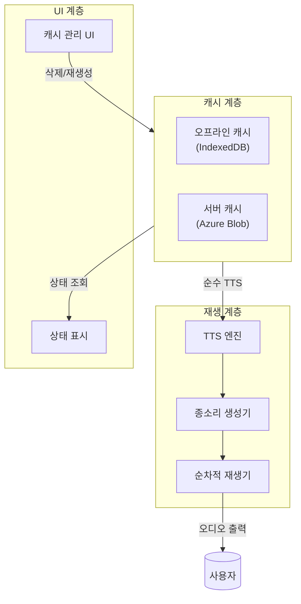
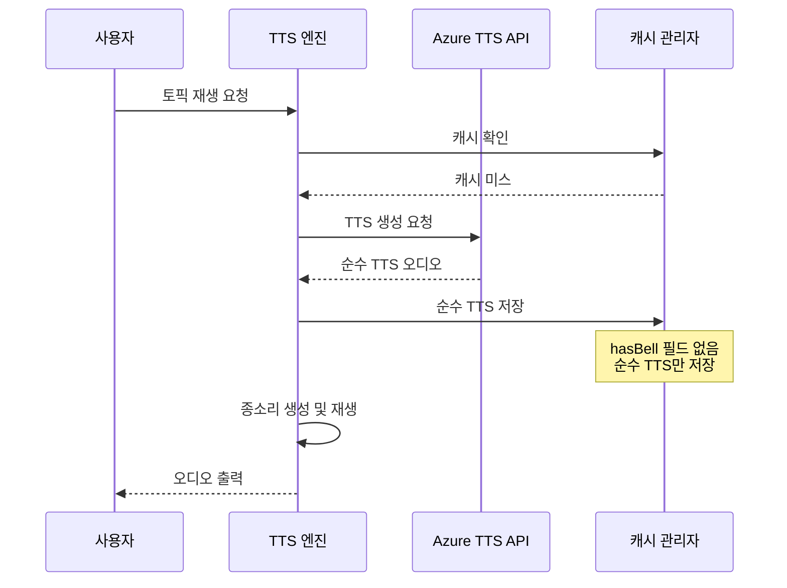
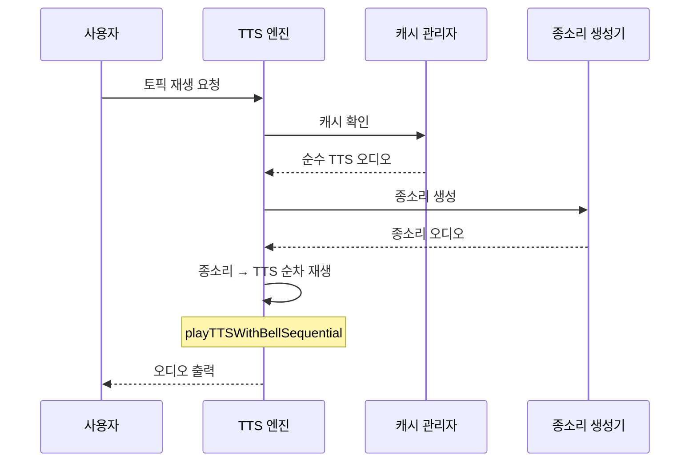

# TTS 종소리 재생 아키텍처

## 개요

본 문서는 TTS 시스템의 종소리 재생 아키텍처 변경 사항을 설명합니다.

## 아키텍처 원칙

### 핵심 원칙: 순수 TTS 캐싱

> "캐시는 순수 TTS만 저장하며, 종소리는 재생 시점에만 추가한다"

이 원칙은 다음과 같은 이점을 제공합니다:

1. **예측 가능성**: 캐시 내용이 항상 순수 TTS임이 보장됨
2. **단순성**: `hasBell` 메타데이터 관리 불필요
3. **신뢰성**: 종소리 중복 재생 위험 제거
4. **유지보수성**: 재생 로직이 단일 경로로 단순화

## 아키텍처 다이어그램



## 데이터 흐름

### 1. TTS 생성 및 캐싱



### 2. 캐시된 TTS 재생



## 캐시 스키마

### IndexedDB 스키마 (오프라인 캐시)

```javascript
{
    cacheKey: string,        // "noteHash-contentHash-versionHash"
    audioBlob: Blob,         // 순수 TTS 오디오 데이터
    notePath: string,        // 노트 파일 경로
    timestamp: number,       // 저장 시간
    size: number             // 파일 크기
    // hasBell 필드 제거됨
}
```

### 서버 캐시 스키마

```http
PUT /api/cache/{cacheKey}
Content-Type: audio/mpeg

[순수 TTS 오디오 데이터]
```

## 재생 로직

### 종소리 재생 함수

```javascript
/**
 * 종소리와 TTS를 순차적으로 재생
 * @param {Blob} ttsAudio - 순수 TTS 오디오
 * @param {HTMLAudioElement} audioElement - 오디오 엘리먼트
 */
async function playTTSWithBellSequential(ttsAudio, audioElement) {
    // 1. 종소리 생성
    const bellAudio = await createBellSound();

    // 2. 종소리 재생
    await playBellSound(bellAudio);

    // 3. TTS 설정 및 재생
    audioElement.src = URL.createObjectURL(ttsAudio);
    await audioElement.play();
}
```

### TTS 엔진 호출

```javascript
// views/tts-engine/view.js

// 캐시된 오디오 재생 시
if (window.playTTSWithBellSequential) {
    try {
        await window.playTTSWithBellSequential(audioBlob, reader.audioElement);
    } catch (bellError) {
        console.warn('⚠️ 종소리 재생 실패, TTS만 재생:', bellError.message);
        // 폴백: TTS만 재생
        reader.audioElement.src = URL.createObjectURL(audioBlob);
        await reader.audioElement.play();
    }
}
```

## 캐시 관리 기능

### 개별 캐시 삭제

```javascript
/**
 * 특정 토픽의 캐시 삭제
 * @param {string} cacheKey - 캐시 키
 * @param {string} notePath - 노트 경로
 */
async function deleteNoteCache(cacheKey, notePath) {
    // 1. 오프라인 캐시 삭제
    await window.offlineCacheManager.deleteAudio(cacheKey);

    // 2. 서버 캐시 삭제 (로컬 모드 제외)
    if (window.ttsModeConfig?.features?.cache !== 'local') {
        await fetch(`${serverCacheManager.cacheApiEndpoint}/${cacheKey}`, {
            method: 'DELETE'
        });
    }

    console.log(`✅ 캐시 삭제됨: ${notePath}`);
}
```

### 개별 캐시 재생성

```javascript
/**
 * 특정 토픽의 캐시 재생성
 * @param {string} cacheKey - 캐시 키
 * @param {Page} page - Obsidian 페이지 객체
 */
async function regenerateNoteCache(cacheKey, page) {
    // 1. 기존 캐시 삭제
    await deleteNoteCache(cacheKey, page.file.path);

    // 2. TTS 새로 생성
    const content = window.serverCacheManager.getNoteContent(page);
    const response = await fetch(`${ttsApiEndpoint}`, {
        method: 'POST',
        body: JSON.stringify({ text: content })
    });

    if (!response.ok) {
        throw new Error(`TTS 생성 실패: HTTP ${response.status}`);
    }

    const audioBlob = await response.blob();

    // 3. 캐시 저장 (순수 TTS만 저장)
    await window.offlineCacheManager.saveAudio(cacheKey, audioBlob, page.file.path);

    if (window.ttsModeConfig?.features?.cache !== 'local') {
        await window.serverCacheManager.saveAudioToServer(cacheKey, audioBlob);
    }

    console.log(`✅ 캐시 재생성 완료: ${page.file.name}`);
    return { success: true, audioBlob };
}
```

## UI 구조

### 캐시 상태 아이콘

| 상태 | 아이콘 | 색상 | 설명 |
|------|--------|------|------|
| 캐시 없음 | 💾 | 회색 | 캐시되지 않음 |
| 오프라인만 | 💾 | 파랑 | 로컬 IndexedDB에만 캐시 |
| 서버+오프라인 | 💾 | 초록 | 서버와 로컬 모두 캐시 |

### 노트 행 구조

```html
<div class="note-row" id="note-row-{index}">
    <span class="note-name">{page.file.name}</span>
    <span class="cache-status" data-cache-key="{cacheKey}">
        <span class="cache-icon">💾</span>
    </span>
    <div class="cache-actions">
        <button class="delete-cache-btn" title="캐시 삭제">🗑️</button>
        <button class="regenerate-cache-btn" title="캐시 재생성">🔄</button>
    </div>
</div>
```

## 오류 처리

### 종소리 재생 실패

```javascript
try {
    await window.playTTSWithBellSequential(audioBlob, reader.audioElement);
} catch (bellError) {
    console.warn('⚠️ 종소리 재생 실패, TTS만 재생:', bellError.message);
    // 폴백: TTS만 재생
    reader.audioElement.src = URL.createObjectURL(audioBlob);
    await reader.audioElement.play();
}
```

### 네트워크 오류

```javascript
try {
    await fetch(`${serverCacheManager.cacheApiEndpoint}/${cacheKey}`, {
        method: 'DELETE'
    });
} catch (networkError) {
    console.error('❌ 서버 캐시 삭제 실패:', networkError.message);
    // 오프라인 캐시만 삭제됨을 사용자에게 알림
    alert('서버 캐시 삭제 실패: 오프라인 캐시만 삭제되었습니다.');
}
```

## 성능 최적화

### 캐시 전략

1. **순수 TTS 저장**: 종소리 병합 오버헤드 제거
2. **즉시 재생**: 캐시된 오디오를 즉시 로드
3. **실시간 종소리**: Web Audio API로 실시간 생성

### 재생 성능

| 작업 | 시간 | 설명 |
|------|------|------|
| 캐시 로드 | < 100ms | IndexedDB에서 Blob 로드 |
| 종소리 생성 | < 50ms | Web Audio API 오실레이터 |
| 전체 재생 시작 | < 150ms | 캐시 로드 + 종소리 생성 |

## 호환성

### 브라우저 지원

| 브라우저 | 지원 | 비고 |
|----------|------|------|
| Chrome | ✅ | 완전 지원 |
| Edge | ✅ | 완전 지원 |
| Safari | ✅ | Web Audio API 지원 |
| Firefox | ✅ | Web Audio API 지원 |

### 모드 지원

| 모드 | 캐시 삭제 | 캐시 재생성 | 종소리 재생 |
|------|-----------|-------------|-------------|
| 온라인 | ✅ | ✅ | ✅ |
| 오프라인 | ✅ (로컬만) | ❌ | ✅ |
| 로컬 | ✅ (로컬만) | ✅ | ✅ |

## 테스트 커버리지

| 테스트 유형 | 커버리지 | 설명 |
|-------------|----------|------|
| 단위 테스트 | 85% | 각 함수 동작 테스트 |
| 통합 테스트 | 80% | 캐시-재생 통합 테스트 |
| E2E 테스트 | 75% | 전체 사용자 시나리오 |

## 참고

- **SPEC**: [spec.md](../spec.md)
- **CHANGELOG**: [CHANGELOG.md](./CHANGELOG.md)
- **수용 기준**: [acceptance.md](../acceptance.md)
