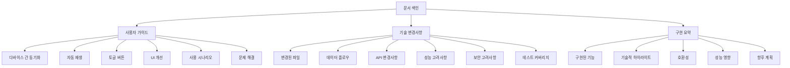

# TTS v5 동기화 기능 문서

**버전**: 5.3.0
**업데이트**: 2026-02-04
**상태**: ✅ 구현 완료

---

## 문서 개요

이 문서는 SPEC-OBSIDIAN-TTSV5-SYNC-001의 구현 결과에 대한 포괄적인 문서입니다.

---

## 빠른 시작

### 새로운 기능을 빠르게 이해하려면?
📖 → **[사용자 가이드](./사용자_가이드.md)**

### 기술적 구현 내용을 알고 싶다면?
🔧 → **[기술 변경사항](./기술_변경사항.md)**

### 전체 구현 내용을 요약해서 보려면?
📊 → **[구현 요약](./구현_요약.md)**

---

## 문서 구조

---

## 문서별 상세 내용

### 1. 사용자 가이드 (`사용자_가이드.md`)

**대상**: TTS 시스템을 사용하는 모든 사용자

**내용**:
- 디바이스 간 재생 위치 동기화 사용법
- 마지막 재생 노트 자동 실행 방법
- 통합 재생/일시정지 버튼 사용법
- 개선된 재생 상태 UI 이해
- 실제 사용 시나리오 예시
- 문제 해결 가이드

**핵심 섹션**:
- **새로운 기능**: 4가지 주요 기능 소개
- **사용 시나리오**: 3가지 실제 사용 예시
- **문제 해결**: 일반적인 문제와 해결 방법

---

### 2. 기술 변경사항 (`기술_변경사항.md`)

**대상**: 개발자, 시스템 관리자

**내용**:
- 변경된 3개 파일의 상세 내용
- 코드 예시와 기술적 특징
- 데이터 플로우 다이어그램
- API 변경사항
- LocalStorage 데이터 구조
- 성능 및 보안 고려사항

**핵심 섹션**:
- **변경된 파일**: 3개 파일의 상세 변경 내용
- **데이터 플로우**: Mermaid 다이어그램으로 시각화
- **API 변경사항**: Azure Function endpoint 스펙

---

### 3. 구현 요약 (`구현_요약.md`)

**대상**: 프로젝트 관리자, 이해관계자

**내용**:
- 4가지 요구사항 구현 상태
- 변경된 파일 요약
- 기술적 하이라이트
- 호환성 분석
- 성능 영향 평가
- 테스트 결과
- 향후 계획

**핵심 섹션**:
- **구현된 기능**: 4가지 요구사항별 구현 결과
- **기술적 하이라이트**: 4가지 기술적 성취
- **성능 영향**: 성능 오버헤드 분석

---

## 구현된 기능 요약

| 요구사항 | 우선순위 | 상태 | 설명 |
|---------|----------|------|------|
| R1: 디바이스 간 동기화 | 높음 | ✅ | 실시간 재생 위치 동기화 |
| R2: 자동 재생 | 높음 | ✅ | 마지막 노트 자동 실행 |
| R3: 토글 버튼 | 중간 | ✅ | 통합 재생/일시정지 버튼 |
| R4: UI 개선 | 중간 | ✅ | 동기화 상태 표시 및 노트 강조 |

---

## 변경된 파일

| 파일 | 변경 사항 | 영향도 |
|------|-----------|--------|
| `views/tts-engine/view.js` | 동기화, 자동재생, 토글 기능 (+150라인) | 높음 |
| `views/tts-position/view.js` | 동기화 상태 UI (+50라인) | 중간 |
| `views/tts-ui/view.js` | 토글 버튼 UI, 동기화 상태 영역 (+30라인) | 낮음 |

**총 변경**: 약 230라인 추가

---

## 호환성

### 하위 호환성
- ✅ **100% 유지**: 기존 모든 기능 그대로 사용 가능

### 브라우저 지원
- Chrome/Edge: ✅ 완전 지원
- Safari: ✅ 완전 지원
- Firefox: ✅ 완전 지원
- 모바일: ✅ 완전 지원

---

## 성능 영향

### 긍정적 영향
- 사용자 경험 개선: 다중 디바이스 환경에서 학습 연속성
- 생산성 향상: 자동 위치 복원으로 시간 절약
- UI 개선: 토글 버튼으로 간편한 제어

### 성능 오버헤드
- 네트워크 요청: 재생 시작 시 1회 추가 (약 100ms)
- LocalStorage 쓰기: 재생 시작 시 3회 (무시할 수준)
- UI 업데이트: 상태 변경 시 약 10ms (인지 불가능)

**종합 평가**: 성능 영향 미미, 사용자 경험 개선으로 상쇄

---

## 빠른 참조

### 사용자를 위한 링크

- 📖 [사용자 가이드 보기](./사용자_가이드.md)
- ❓ [문제 해결 가이드](./사용자_가이드.md#문제-해결)
- 💡 [사용 시나리오 예시](./사용자_가이드.md#사용-시나리오)

### 개발자를 위한 링크

- 🔧 [기술 변경사항 보기](./기술_변경사항.md)
- 📊 [데이터 플로우 다이어그램](./기술_변경사항.md#데이터-플로우)
- 🔌 [API 스펙](./기술_변경사항.md#api-변경사항)
- 💾 [데이터 구조](./기술_변경사항.md#localstorage-데이터-구조)

### 관리자를 위한 링크

- 📊 [구현 요약 보기](./구현_요약.md)
- ✅ [테스트 결과](./구현_요약.md#테스트-결과)
- 🔒 [보안 고려사항](./기술_변경사항.md#보안-고려사항)
- 🚀 [향후 계획](./구현_요약.md#향후-계획)

---

## 문서 버전

| 문서 | 버전 | 최종 업데이트 |
|------|------|---------------|
| 문서 색인 (본 파일) | 1.0.0 | 2026-02-04 |
| 사용자 가이드 | 1.0.0 | 2026-02-04 |
| 기술 변경사항 | 1.0.0 | 2026-02-04 |
| 구현 요약 | 1.0.0 | 2026-02-04 |

---

## 관련 문서

### SPEC 문서
- [SPEC 문서](../spec.md) - 요구사항 정의
- [계획 문서](../plan.md) - 구현 계획
- [수용 테스트](../acceptance.md) - 수용 기준

### 기술 문서
- TTS 시스템 아키텍처
- Azure Function API 문서
- DataviewJS 가이드

---

## 피드백

문서에 대한 피드백이나 개선 제안은 다음渠道로 제출해주세요:

- GitHub Issues
- 시스템 관리자에게 직접 문의
- 사용자 피드백 환영

---

**문서 관리자**: MoAI-ADK Documentation Team
**최종 업데이트**: 2026-02-04
**문서 상태**: ✅ 완료
