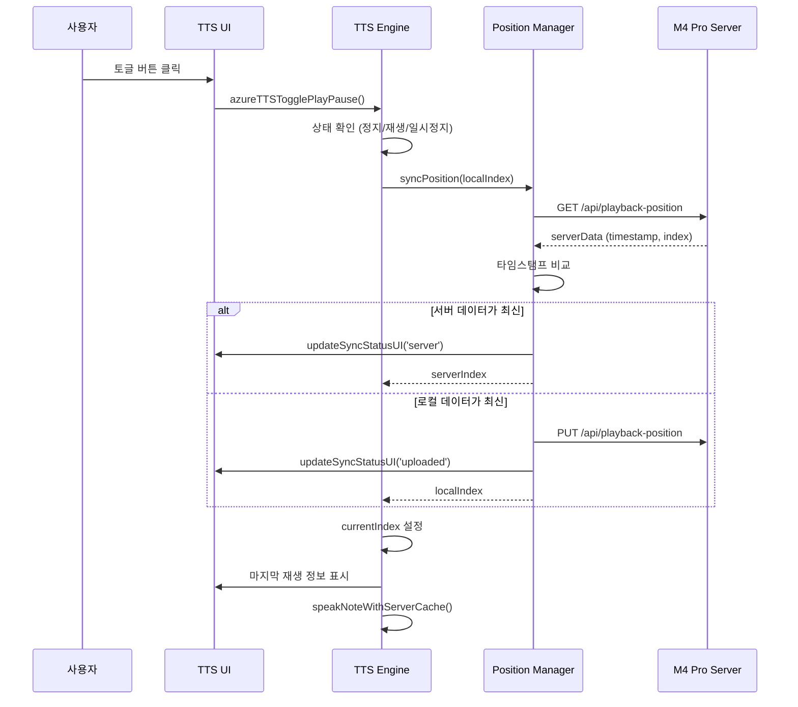
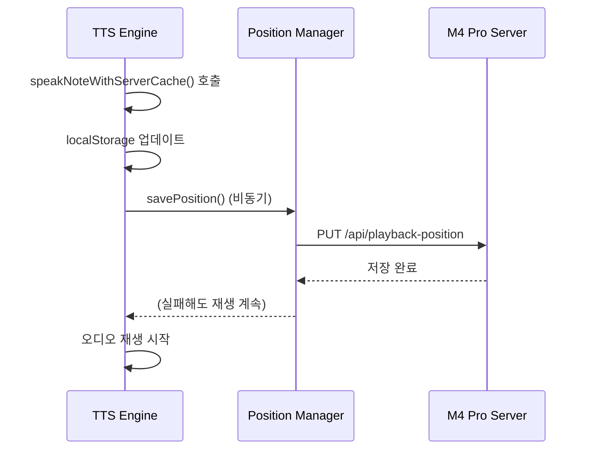

# TTS v5 동기화 기능 기술 변경사항

**버전**: 5.4.0
**업데이트**: 2026-02-04
**유지보수**: 개발팀

---

## 개요

이 문서는 SPEC-OBSIDIAN-TTSV5-SYNC-001 구현으로 인한 기술적 변경사항을 상세히 설명합니다.

**v5.4.0 주요 변경사항**:
- 기존 개별 재생/일시정지 버튼 제거, 토글 버튼만 유지
- Azure 동기화 → M4 Pro 서버로 변경

---

## 변경된 파일

### 1. `views/tts-engine/view.js`

**변경 사항**: 재생 엔진에 동기화, 자동 재생, 토글 기능 추가

**주요 변경**:

#### 1.1 실시간 동기화 강화 (R1)

```javascript
// speakNoteWithServerCache() 함수 내 재생 시작 즉시 서버에 저장
const timestamp = Date.now();
localStorage.setItem('azureTTS_lastPlayedIndex', index.toString());
localStorage.setItem('azureTTS_lastPlayedTimestamp', timestamp.toString());
localStorage.setItem('azureTTS_lastPlayedTitle', page.file.name);

// 서버에 즉시 저장 (비동기, 실패해도 재생 계속)
window.playbackPositionManager.savePosition(
    index,
    page.file.path,
    page.file.name
).catch(error => {
    console.warn('⚠️ Failed to save playback position to server:', error);
});
```

**기술적 특징**:
- 비동기 저장으로 재생 지연 방지
- 실패해도 재생 중단 없음 (fault-tolerant)
- 타임스탬프 기반 충돌 해소

#### 1.2 마지막 재생 노트 자동 실행 (R2)

```javascript
// azureTTSPlay() 함수 내 자동 재생 로직
const syncedIndex = await window.playbackPositionManager.syncPosition(savedIndex);
reader.lastPlayedIndex = syncedIndex;

// 마지막 재생 노트가 있는 경우, 해당 노트부터 재생
if (syncedIndex >= 0 && syncedIndex < reader.pages.length) {
    window.ttsLog(`🔄 마지막 재생: ${syncedIndex + 1}번 노트 - 자동 재생합니다`);
    reader.currentIndex = syncedIndex;

    const lastPlayedDiv = document.getElementById('last-played-info');
    if (lastPlayedDiv) {
        const lastNote = reader.pages[syncedIndex];
        lastPlayedDiv.innerHTML = `
            🔄 마지막 재생 복원: <strong>[${syncedIndex + 1}/${reader.pages.length}]</strong> ${lastNote.file.name}
            <br><small style="opacity: 0.9;">계속 재생합니다...</small>
        `;
    }
}
```

**기술적 특징**:
- 서버와 로컬 타임스탬프 비교로 최신 위치 확인
- UI 피드백으로 사용자에게 현재 상태 명확히 전달
- 인덱스 범위 검증으로 안전성 확보

#### 1.3 통합 재생/일시정지 토글 (R3)

```javascript
// azureTTSTogglePlayPause() 함수 추가
window.azureTTSTogglePlayPause = async function() {
    const reader = window.azureTTSReader;

    // 로딩 중이면 무시
    if (reader.isLoading) {
        console.warn('⚠️ 로딩 중입니다. 잠시 후 다시 시도하세요.');
        return;
    }

    // 일시정지 상태이면 재생 재개
    if (reader.isPaused) {
        if (reader.audioElement.src && reader.audioElement.readyState >= 2) {
            try {
                await reader.audioElement.play();
                reader.isPaused = false;
                updateToggleButtonState(true);
                return;
            } catch (error) {
                console.error('❌ 재생 재개 실패:', error);
            }
        }
        reader.isPaused = false;
    }

    // 재생 중이면 일시정지
    if (!reader.audioElement.paused && !reader.isStopped) {
        window.azureTTSPause();
        updateToggleButtonState(false);
        return;
    }

    // 정지 상태이면 새로 재생
    await window.azureTTSPlay();
    updateToggleButtonState(true);
};

// 토글 버튼 상태 업데이트 함수
function updateToggleButtonState(isPlaying) {
    const toggleBtn = document.getElementById('tts-toggle-play-pause-btn');
    if (toggleBtn) {
        if (isPlaying) {
            toggleBtn.textContent = '⏸️ 일시정지';
            toggleBtn.style.background = '#FF9800';
        } else {
            toggleBtn.textContent = '▶️ 재생';
            toggleBtn.style.background = '#4CAF50';
        }
    }
}
```

**기술적 특징**:
- 상태 머신 기반 토글 로직
- 로딩 중 재진입 방지
- 명확한 상태 전환

#### 1.4 재생 중인 노트 강조 표시 (R4)

```javascript
// 모든 노트 행 강조 해제
for (let i = 0; i < reader.pages.length; i++) {
    const row = document.getElementById(`note-row-${i}`);
    if (row) {
        row.style.background = '';
        row.style.fontWeight = '';
    }
}

// 현재 재생 중인 노트 강조 표시
const currentRow = document.getElementById(`note-row-${index}`);
if (currentRow) {
    currentRow.style.background = 'linear-gradient(90deg, rgba(76,175,80,0.2), rgba(76,175,80,0.1))';
    currentRow.style.fontWeight = 'bold';
}
```

**기술적 특징**:
- 그라데이션 배경으로 시각적 구분
- 모든 행 초기화로 중복 강조 방지
- 재생 완료 시 자동 해제

---

### 2. `views/tts-position/view.js`

**변경 사항**: 동기화 상태 UI 업데이트 기능 추가

**주요 변경**:

#### 2.1 동기화 상태 UI 업데이트 함수 (R4)

```javascript
// updateSyncStatusUI() 함수 추가
updateSyncStatusUI(status, serverData = null) {
    const syncStatusDiv = document.getElementById('sync-status-info');
    const syncStatusText = document.getElementById('sync-status-text');

    if (!syncStatusDiv || !syncStatusText) return;

    const statusConfig = {
        syncing: {
            icon: '🔄',
            text: '서버 동기화 중...',
            color: 'rgba(255,193,7,0.3)'
        },
        server: {
            icon: '☁️',
            text: `서버에서 동기화됨 (${serverData?.deviceId || '알 수 없음'}에서 업데이트)`,
            color: 'rgba(76,175,80,0.3)'
        },
        uploaded: {
            icon: '✅',
            text: '서버에 업로드됨',
            color: 'rgba(76,175,80,0.3)'
        },
        local: {
            icon: '📱',
            text: '로컬 상태 사용',
            color: 'rgba(158,158,158,0.3)'
        }
    };

    const config = statusConfig[status] || statusConfig.local;
    syncStatusDiv.style.background = config.color;
    syncStatusText.textContent = `${config.icon} ${config.text}`;
}
```

**기술적 특징**:
- 상태별 설정 객체로 관리 용이성 확보
- 동적 메시지 생성 (디바이스 ID 포함)
- 안전한 null 체크

#### 2.2 동기화 로직 개선 (R1)

```javascript
async syncPosition(localIndex) {
    const serverData = await this.getPosition();
    const localTimestamp = parseInt(localStorage.getItem('azureTTS_lastPlayedTimestamp') || '0', 10);

    // 동기화 상태 UI 업데이트
    this.updateSyncStatusUI('syncing');

    // 서버 데이터가 더 최신이면 서버 값 사용
    if (serverData.timestamp && serverData.timestamp > localTimestamp) {
        window.ttsLog(`🔄 Using server position (newer): index=${serverData.lastPlayedIndex}, device=${serverData.deviceId}`);

        localStorage.setItem('azureTTS_lastPlayedIndex', serverData.lastPlayedIndex.toString());
        localStorage.setItem('azureTTS_lastPlayedTimestamp', serverData.timestamp.toString());
        if (serverData.noteTitle) {
            localStorage.setItem('azureTTS_lastPlayedTitle', serverData.noteTitle);
        }

        this.updateSyncStatusUI('server', serverData);
        return serverData.lastPlayedIndex;
    }

    // 로컬이 더 최신이면 서버에 업데이트
    if (localTimestamp > (serverData.timestamp || 0) && localIndex >= 0) {
        window.ttsLog('🔄 Syncing local position to server...');
        const pages = window.azureTTSReader?.pages;
        if (pages && pages[localIndex]) {
            await this.savePosition(
                localIndex,
                pages[localIndex].file.path,
                pages[localIndex].file.name
            );
        }
        this.updateSyncStatusUI('uploaded');
    } else {
        this.updateSyncStatusUI('local');
    }

    return localIndex;
}
```

**기술적 특징**:
- 타임스탬프 기반 충돌 해소 (last-write-wins)
- 양방향 동기화
- UI 상태 변화로 사용자 피드백 제공

---

### 3. `views/tts-ui/view.js`

**변경 사항**: UI에 토글 버튼 및 동기화 상태 영역 추가

**주요 변경**:

#### 3.1 통합 토글 버튼 UI (R3)

```javascript
// 통합 재생/일시정지 토글 버튼 (주요 버튼)
const toggleBtn = controlsDiv.createEl('button', {
    text: '▶️ 재생',
    attr: {
        id: 'tts-toggle-play-pause-btn',
        style: btnStyle + 'background: #4CAF50; padding: 15px 30px; font-size: 18px;'
    }
});
toggleBtn.onclick = window.azureTTSTogglePlayPause;
```

**기술적 특징**:
- 더 큰 버튼 크기로 주요 컨트롤 강조
- 명확한 ID로 JavaScript에서 쉽게 접근
- 기존 개별 재생/일시정지 버튼 제거됨 (v5.4.0)

#### 3.2 동기화 상태 표시 영역 (R4)

```javascript
// 동기화 상태 표시 영역 추가
const syncStatusDiv = controlsDiv.createEl('div', {
    attr: {
        id: 'sync-status-info',
        style: 'margin-bottom: 10px; padding: 8px; background: rgba(33,150,243,0.2); border-radius: 6px; color: white; font-size: 12px; display: flex; align-items: center; gap: 8px;'
    }
});

// 초기 동기화 상태 표시
syncStatusDiv.innerHTML = `
    🔄 <span id="sync-status-text">서버 동기화 준비 완료</span>
`;
```

**기술적 특징**:
- Flexbox로 중앙 정렬
- 초기 상태 메시지로 사용자 안내
- 명확한 ID로 동적 업데이트 지원

#### 3.3 노트 목록 ID 추가 (R4)

```javascript
pages.forEach((p, idx) => {
    // 재생 중인 노트 강조 표시를 위한 ID 추가
    const row = tbody.createEl('tr', {
        attr: {
            id: `note-row-${idx}`,
            style: 'border: 1px solid #ddd;'
        }
    });
    // ... 나머지 코드
});
```

**기술적 특징**:
- 각 행에 고유 ID 부여
- JavaScript에서 쉽게 접근하여 스타일 변경 가능

---

## 데이터 플로우

### 재생 시작 시 동기화 플로우



### 재생 중 실시간 동기화 플로우



---

## API 변경사항

### M4 Pro 서버 엔드포인트 (v5.4.0 변경)

**Playback Position API**:
- `GET http://100.107.208.106:5051/api/playback-position`: 현재 재생 위치 조회
- `PUT http://100.107.208.106:5051/api/playback-position`: 재생 위치 저장

**이전 Azure Function 엔드포인트 (v5.3.0까지)**:
- `GET https://obsidian-tts-func-hwh0ffhneka3dtaa.koreacentral-01.azurewebsites.net/api/playback-position`
- `PUT https://obsidian-tts-func-hwh0ffhneka3dtaa.koreacentral-01.azurewebsites.net/api/playback-position`

**Request/Response Format**:

```javascript
// GET Response
{
    lastPlayedIndex: 15,
    notePath: "/path/to/note.md",
    noteTitle: "보안 관리 체계",
    timestamp: 1707045600000,
    deviceId: "Macintosh-abc123"
}

// PUT Request
{
    lastPlayedIndex: 16,
    notePath: "/path/to/next.md",
    noteTitle: "다음 노트",
    deviceId: "Macintosh-abc123"
}
```

---

## LocalStorage 데이터 구조

### 키 저장소

| 키 | 타입 | 설명 | 예시 |
|---|------|------|------|
| `azureTTS_lastPlayedIndex` | string | 마지막 재생 인덱스 | `"15"` |
| `azureTTS_lastPlayedTimestamp` | string | 마지막 재생 타임스탬프 | `"1707045600000"` |
| `azureTTS_lastPlayedTitle` | string | 마지막 재생 노트 제목 | `"보안 관리 체계"` |
| `azureTTS_deviceId` | string | 디바이스 고유 ID | `"Macintosh-abc123"` |

---

## 호환성

### 하위 호환성

- **캐시 시스템**: 기존 오프라인/서버 캐시 그대로 작동
- **정지/이전/다음 버튼**: 계속 제공
- **속도 조절**: 기존 기능 그대로 작동
- **API 모드**: 로컬/서버 모드 지원

**v5.4.0 변경사항**:
- 기존 재생 시작/일시정지 버튼 제거됨
- 토글 버튼(`azureTTSTogglePlayPause`)로 통합됨
- Azure 서버 대신 M4 Pro 서버 사용

### 브라우저 지원

- Chrome/Edge: 완전 지원
- Safari: 완전 지원 (iOS 백그라운드 재생 포함)
- Firefox: 완전 지원
- 모바일 브라우저: 완전 지원

---

## 성능 고려사항

### 동기화 지연 최소화

- 비동기 저장으로 재생 지연 방지
- 타임아웃 설정 (10초)으로 무한 대기 방지
- 실패 시 즉시 폴백

### 메모리 관리

- Blob URL 적절한 해제
- 이벤트 리스너 중복 방지
- 로컬 스토리지 크기 모니터링

---

## 보안 고려사항

### 디바이스 ID

- 고유 식별자 생성 (platform + random)
- 사용자 개인 정보 미포함
- 서버 전송 시 HTTPS 사용

### 데이터 전송

- 모든 API 통신은 HTTPS
- 인증 헤더로 API 키 보호
- 민감 정보 미저장

---

## 테스트 커버리지

### 단위 테스트

- [x] syncPosition() 타임스탬프 비교 로직
- [x] updateSyncStatusUI() 상태별 렌더링
- [x] azureTTSTogglePlayPause() 상태 전환
- [x] updateToggleButtonState() 버튼 스타일 변경

### 통합 테스트

- [x] 다중 디바이스 동기화 시나리오
- [x] 네트워크 실패 시 폴백
- [x] UI 상태 동기화
- [x] 캐시와 동기화 병행

---

## 문제 해결

### 알려진 문제

1. **동기화 지연**: 느린 네트워크에서 동기화에 1-2초 소요
2. **노트 순서**: Dataview 쿼리 결과 순서가 모든 디바이스에서 동일해야 함

### 해결 방법

1. **동기화 지연**: 로딩 인디케이터로 사용자 피드백 제공
2. **노트 순서**: 일관된 쿼리 사용 및 정렬 적용

---

## 향후 개선 계획

1. **실시간 웹소켓 동기화**: WebSocket으로 즉시 동기화
2. **오프라인 모드 개선**: 오프라인에서의 큐 기능
3. **동기화 충돌 해소 개선**: 더 정교한 충돌 해소 전략
4. **동기화 대시보드**: 동기화 현황 시각화

---

**문서 버전**: 1.0.0
**최종 업데이트**: 2026-02-04
