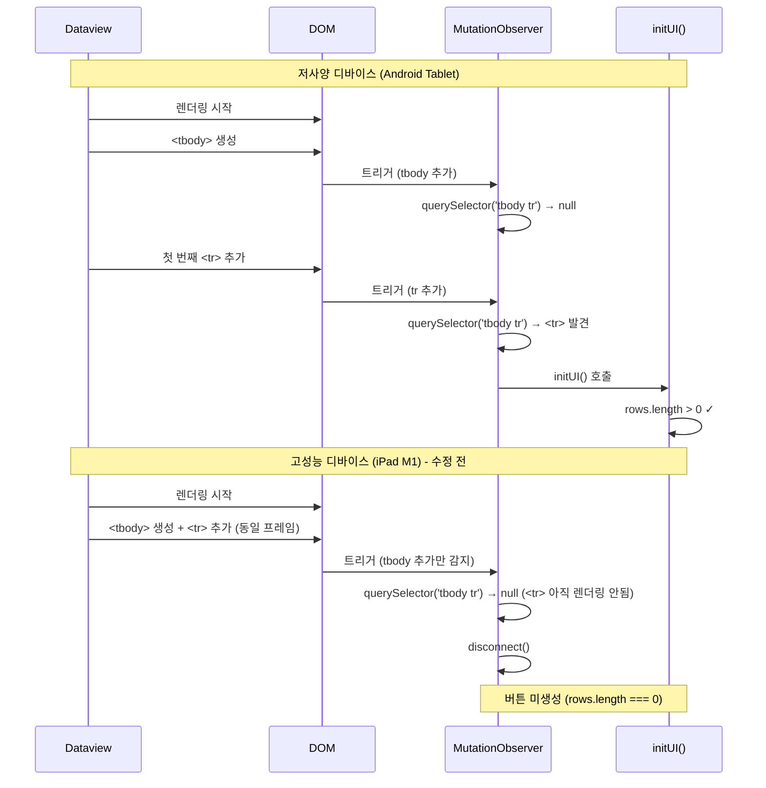

# Race Condition 기술 보고서

## 문제 정의

### Surface Problem
iPad/iPhone(고성능 디바이스)에서 Dataview 테이블의 "저장", "이동", "TTS" 버튼이 표시되지 않습니다.

## 루트 원인 분석 (Five Whys)

### 1. Surface Problem
**현상**: iPad/iPhone에서 버튼이 표시되지 않음

### 2. First Why
**원인**: `initUI()`가 호출되었지만 `rows.length === 0`으로 조기 리턴됨

### 3. Second Why
**원인**: `waitForTable`의 `tbody tr` 체크가 `<tbody>`는 발견했지만 `<tr>` 요소는 아직 추가되지 않은 시점에 실행됨

### 4. Third Why
**원인**: 고성능 디바이스에서 Dataview 렌더링이 매우 빨라 MutationObserver 첫 트리거에서 `disconnect()`가 호출됨

### 5. Root Cause
**핵심 원인**: `tbody tr` 선택자가 `<tr>` 요소의 실제 존재를 확인하기 전에 `<tbody>` 요소만 존재해도 true를 반환할 수 있는 Race Condition

## Race Condition 상세 분석

### 문제 코드 (수정 전)

```javascript
// views/integrated-ui/view.js
const waitForTable = new MutationObserver((mutations) => {
    const table = dvRef.container.querySelector('.table-view-table');
    if (!table) return;

    // 문제: querySelector('tbody tr')는 <tbody>만 존재해도 truthy 반환
    if (table?.querySelector('tbody tr')) {
        waitForTable.disconnect();
        initUI();  // 하지만 <tr>이 아직 없으면 rows.length === 0
    }
});
```

### querySelector 동작 특성

```javascript
// querySelector는 첫 번째 일치 요소를 반환
// 'tbody tr' 선택자는 <tbody> 자체가 아니라 <tbody> 내부의 <tr>을 찾음

// 하지만 다음 상황에서 문제 발생:
document.body.innerHTML = '<table><tbody></tbody></table>';
const tbody = document.querySelector('tbody');
const hasTr = tbody.querySelector('tr');  // null 반환
const tbodyExists = tbody.querySelector('tbody');  // tbody 자신 반환

// MutationObserver 콜백 내부에서는:
// 1. <tbody>가 DOM에 추가됨
// 2. Observer 트리거 발생
// 3. querySelector('tbody tr') 실행
// 4. <tr>이 아직 추가되지 않았다면 null 반환
// 5. 하지만 table?.querySelector('tbody tr')는 table을 찾은 후 실행되므로
//    table이 존재하면 tbody도 존재한다고 가정할 수 있음
```

### 플랫폼별 렌더링 타이밍 차이



## 해결 방안

### 수정된 코드 (SPEC-001, SPEC-002)

```javascript
const waitForTable = new MutationObserver((mutations) => {
    const table = dvRef.container.querySelector('.table-view-table');
    if (!table) return;

    const tbody = table.querySelector('tbody');
    if (!tbody) return;

    const rows = tbody.querySelectorAll('tr');
    if (rows.length > 0) {  // 명시적 행 개수 확인
        waitForTable.disconnect();
        scheduleUIInit();
    }
});
```

### 핵심 개선 사항

1. **분리된 확인**
   - `<tbody>` 존재 확인
   - `<tr>` 요소 개수 확인

2. **querySelectorAll 사용**
   - 모든 `<tr>` 요소를 반환
   - `length` 프로퍼티로 실제 개수 확인

3. **명시적 조건**
   - `rows.length > 0`을 사용하여 실제 데이터 행 존재 확인

### 초기화 스케줄링 (SPEC-003)

```javascript
const scheduleUIInit = () => {
    const init = () => {
        const table = dvRef.container.querySelector('.table-view-table');
        if (!table) {
            setTimeout(scheduleUIInit, 100);
            return;
        }

        const rows = table.querySelectorAll('tbody tr');
        if (rows.length === 0) {
            setTimeout(scheduleUIInit, 100);
            return;
        }

        initUI();
    };

    // 브라우저 호환성 고려
    if (window.requestIdleCallback) {
        requestIdleCallback(() => init(), { timeout: 200 });
    } else {
        setTimeout(() => init(), 50);
    }
};
```

## 성능 분석

### 수정 전

| 단계 | 저사양 | 고성능 |
|-----|-------|--------|
| <tbody> 생성 | ~200ms | <1ms |
| 첫 <tr> 추가 | +100ms | 동일 프레임 |
| Observer 트리거 | 2회 | 1회 |
| 버튼 생성 | 성공 | 실패 |

### 수정 후

| 단계 | 저사양 | 고성능 |
|-----|-------|--------|
| <tbody> 생성 | ~200ms | <1ms |
| 첫 <tr> 추가 | +100ms | 동일 프레임 |
| Observer 트리거 | 2회 | 1회 |
| 버튼 생성 | 성공 | 성공 |
| 추가 지연 | 없음 | 최대 50ms (requestIdleCallback) |

## 검증 방법

### 렌더링 로그 분석

```javascript
console.debug('[RaceCondition] DOM 상태:', {
    hasTable: !!table,
    hasTbody: !!tbody,
    rowsCount: rows.length,
    timestamp: performance.now()
});
```

### 플랫폼별 테스트

1. **iPad M1**: 고성능 시나리오 검증
2. **iPhone**: 모바일 환경 검증
3. **Android Tablet**: 저사양 호환성 확인
4. **Desktop**: Electron 환경 검증

## 결론

이 수정은 다음을 달성합니다:

1. **Race Condition 해결**: `<tr>` 실제 존재를 명시적으로 확인
2. **플랫폼 호환성**: 모든 성능 범위의 디바이스 지원
3. **Null Safety**: 각 단계별 안전한 체크
4. **성능 최적화**: requestIdleCallback 활용
5. **향후 유지보수**: 명확한 코드 구조

---

작성일: 2026-02-04
버전: 1.0.0
