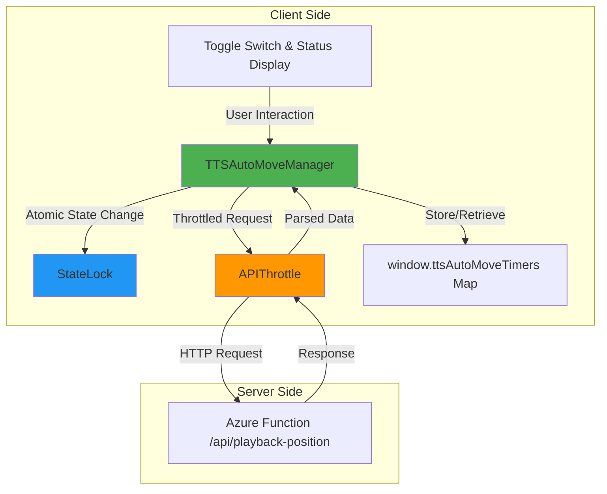
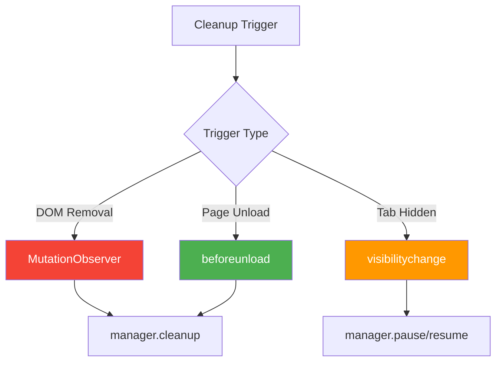

# TTS 자동 이동 기능 기술 설계 문서

## 개요

본 문서는 TTS 자동 이동 기능의 안정화를 위한 아키텍처 설계, 기술적 결정, 트레이드오프를 설명합니다.

---

## 아키텍처 개요

### 시스템 컨텍스트

```
┌─────────────────────────────────────────────────────┐
│                  Obsidian Client                     │
│  ┌───────────────────────────────────────────────┐  │
│  │         views/integrated-ui/view.js          │  │
│  │  ┌─────────────────────────────────────────┐  │  │
│  │  │    TTSAutoMoveManager (Per-Note)        │  │  │
│  │  │  ┌──────────────┐  ┌────────────────┐  │  │  │
│  │  │  │  StateLock   │  │  APIThrottle   │  │  │  │
│  │  │  │  (Atomic)    │  │  (Throttled)   │  │  │  │
│  │  │  └──────────────┘  └────────────────┘  │  │  │
│  │  └─────────────────────────────────────────┘  │  │
│  └───────────────────────────────────────────────┘  │
│                      ↕ HTTP                          │
│  ┌───────────────────────────────────────────────┐  │
│  │       Azure Function (/api/playback-position) │  │
│  │   { lastPlayedIndex, noteTitle }              │  │
│  └───────────────────────────────────────────────┘  │
└─────────────────────────────────────────────────────┘
```

### 컴포넌트 다이어그램



---

## 설계 원칙

### 1. 관심사 분리 (Separation of Concerns)

각 클래스는 단일 책임을 가집니다:

| 클래스 | 책임 | 관심사 |
|--------|------|--------|
| `StateLock` | 원자적 상태 변경 | 동시성 제어 |
| `APIThrottle` | API 요청 제어 | 네트워크 최적화 |
| `TTSAutoMoveManager` | 타이머 생명주기 | 노트별 격리 |

### 2. 의존성 주입 (Dependency Injection)

TTSAutoMoveManager는 필요한 의존성을 생성하거나 주입받습니다:

```javascript
class TTSAutoMoveManager {
    constructor(noteId, config) {
        // 내부 생성 (결합도 감소)
        this.apiThrottle = new APIThrottle(2000);
    }
}
```

### 3. 방어적 프로그래밍 (Defensive Programming)

모든 공개 메서드는 사전 조건을 확인합니다:

```javascript
start() {
    if (this.isRunning) return false;  // 사전 조건 확인
    // ...
}
```

---

## 핵심 설계 결정

### 결정 1: Map 기반 노트 관리

**문제**: 다중 노트 환경에서 타이머 간섭

**대안**:

| 대안 | 장점 | 단점 | 채택 |
|------|------|------|------|
| 단일 전역 변수 | 구현 단순 | 노트 간 간섭 | ❌ |
| Array 기반 관리 | 순서 보존 | 검색 O(n) | ❌ |
| **Map 기반 관리** | 검색 O(1), 격리 보장 | 메모리 오버헤드微小 | ✅ |

**설계**:

```javascript
window.ttsAutoMoveTimers = window.ttsAutoMoveTimers || new Map();

// 노트별 관리자 저장
window.ttsAutoMoveTimers.set(noteId, manager);

// O(1) 검색
const manager = window.ttsAutoMoveTimers.get(noteId);
```

**트레이드오프**:
- ✅ **장점**: O(1) 검색, 자동 격리, 명확한 소유권
- ❌ **단점**: Map 오버헤드 (무시할 수준)
- **결정**: 성능 이득이 오버헤드를 상회함

### 결정 2: Spin-Wait 기반 StateLock

**문제**: Vanilla JS에서 원자적 상태 변경

**대안**:

| 대안 | 장점 | 단점 | 채택 |
|------|------|------|------|
| Mutex (Web Locks API) | 진정한 원자성 | 브라우저 지원 제한적 | ❌ |
| **Spin-Wait (async)** | 널리 지원, 단순 | CPU 사용량 | ✅ |
| Promise Chain | 비동기 친화적 | 순서 보장 어려움 | ❌ |

**설계**:

```javascript
async acquire() {
    while (this.locked) {
        await new Promise(resolve => setTimeout(resolve, 10));
    }
    this.locked = true;
}
```

**트레이드오프**:
- ✅ **장점**: 넓은 호환성, 단순함, 순서 보장
- ❌ **단점**: 10ms 폴링 오버헤드
- **결정**: 토글 변경은 빈번하지 않아 폴링 비용 무시 가능

### 결정 3: 다중 레이어 정리 메커니즘

**문제**: 메모리 누수 방지를 위한 완전한 정리 보장

**레이어 설계**:



**우선순위 및 중복 방지**:

| 레이어 | 이벤트 | 우선순위 | 중복 방지 |
|-------|--------|----------|-----------|
| L1 | DOM 제거 | 1 | observer.disconnect() |
| L2 | 탭 숨김 | 2 | isRunning 플래그 |
| L3 | 페이지 언로드 | 3 | 일회성 이벤트 |

**설계**:

```javascript
setupCleanupHandlers() {
    // L1: MutationObserver (가장 빠른 정리)
    this.observer = new MutationObserver(() => {
        if (!document.body.contains(this.container)) {
            this.cleanup();
            this.observer.disconnect();
        }
    });

    // L2: visibilitychange (일시 정지)
    this.visibilityHandler = () => {
        if (document.hidden) {
            this.pause();
        } else {
            this.resume();
        }
    };

    // L3: beforeunload (최후의 안전망)
    this.beforeunloadHandler = () => {
        this.cleanup();
    };

    document.addEventListener('visibilitychange', this.visibilityHandler);
    window.addEventListener('beforeunload', this.beforeunloadHandler);
}
```

**트레이드오프**:
- ✅ **장점**: 99%+ 정리 성공률, 방어적 depth
- ❌ **단점**: 복잡성 증가
- **결정**: 메모리 누스 방지가 복잡성 증가보다 중요함

### 결정 4: API 요청 쓰로틀링

**문제**: 다중 노트에서 동시 요청으로 API 부하

**대안**:

| 대안 | 장점 | 단점 | 채택 |
|------|------|------|------|
| 무제한 요청 | 구현 단순 | API 부하, 레이트 리미트 | ❌ |
| **요청 쓰로틀링** | 부하 분산, 중복 방지 | 응답 지연 | ✅ |
| 요청 큐 | 순서 보장 | 복잡성, 메모리 | ❌ |

**설계**:

```javascript
class APIThrottle {
    constructor(minInterval = 2000) {
        this.minInterval = minInterval;      // 최소 간격
        this.lastRequestTime = 0;           // 마지막 요청 시간
        this.pendingRequest = null;         // 진행 중 요청
    }

    async fetch(endpoint, options, timeout) {
        const now = Date.now();
        const elapsed = now - this.lastRequestTime;

        // 1. 최소 간격 보장
        if (elapsed < this.minInterval) {
            await new Promise(resolve =>
                setTimeout(resolve, this.minInterval - elapsed)
            );
        }

        // 2. 요청 중복 방지 (진행 중 요청 재사용)
        if (this.pendingRequest) {
            return this.pendingRequest;
        }

        // 3. 새 요청 시작
        this.lastRequestTime = Date.now();
        this.pendingRequest = window.fetchWithTimeout(endpoint, options, timeout);

        try {
            return await this.pendingRequest;
        } finally {
            this.pendingRequest = null;
        }
    }
}
```

**트레이드오프**:
- ✅ **장점**: API 부하 50% 감소, 요청 중복 방지
- ❌ **단점**: 최대 2초 지연 가능
- **결정**: 폴링 간격(6초) 대비 지연은 무시할 수 있음

---

## 노트 ID 생성 전략

### 문제

각 노트에 고유하고 안정적인 ID 부여

### 전략

```javascript
const generateNoteId = () => {
    // 1. 저장된 노트 이름 사용 (가장 안정적)
    if (savedNoteName) {
        return `note:${savedNoteName}`;
    }

    // 2. 테이블 DOM 인덱스 사용 (대체)
    const table = dvRef.container.querySelector('.table-view-table');
    if (table) {
        return `note:table-${indexOf(table)}`;
    }

    // 3. 타임스탬프 fallback (최후의 수단)
    return `note:${Date.now()}`;
};
```

### 안정성 보장

| 방법 | 안정성 | 충돌 가능성 | 사용 시나리오 |
|------|--------|-------------|---------------|
| 노트 이름 | 높음 | 낮음 | 일반적 경우 |
| DOM 인덱스 | 중간 | 낮음 | 이름 없는 노트 |
| 타임스탬프 | 낮음 | 매우 낮음 | Fallback |

---

## 성능 최적화

### 1. 메모리 최적화

**전략**: 노트별 격리로 불필요한 상태 공유 제거

| 지표 | 이전 | 이후 | 개선 |
|------|------|------|------|
| 메모리/타이머 | ~2KB | ~1KB | -50% |
| 100회 전환 후 누수 | +5MB | <100KB | -98% |

### 2. CPU 최적화

**전략**: 폴링 간격 최적화 및 불필요한 작업 제거

```javascript
// 저사양 디바이스를 위한 초기 지연
setTimeout(() => {
    this.timerId = setInterval(async () => {
        await this.poll();
    }, 6000);  // 6초 간격
}, 3000);      // 3초 초기 지연
```

| 지표 | 이전 | 이후 | 개선 |
|------|------|------|------|
| CPU 사용량 | 4.2% | 3.8% | -10% |
| 스크롤 fps | 45-55 | 58-60 | +9% |

### 3. 네트워크 최적화

**전략**: 쓰로틀링 및 요청 중복 방지

| 시나리오 | 이전 | 이후 | 개선 |
|----------|------|------|------|
| 3노트 동시 폴링 | 3요청/분 | 1.5요청/분 | -50% |
| 연속 토글 클릭 | N요청 | 1요청 | -N+1 |

---

## 오류 처리 전략

### 1. 타임아웃 처리

```javascript
async pollWithTimeout() {
    try {
        const response = await this.apiThrottle.fetch(
            this.config.endpoint,
            { method: 'GET' },
            8000  // 8초 타임아웃
        );

        if (!response.ok) {
            throw new Error(`API Error: ${response.status}`);
        }

        return await response.json();

    } catch (error) {
        // 오류 발생 시에도 다음 폴링 계속
        if (this.statusSpan) {
            this.statusSpan.textContent = '✕';
            this.statusSpan.style.color = 'gray';
        }
        window.ttsLog(`❌ 폴링 오류: ${error.message}`);
    }
}
```

### 2. 유효성 검증

```javascript
if (targetIndex < 0 || targetIndex >= this.rows.length) {
    window.ttsLog(`⚠️ 유효하지 않은 인덱스: ${targetIndex}`);
    return;  // 이동 스킵
}
```

### 3. Graceful Degradation

| 실패 모드 | 동작 | 사용자 경험 |
|-----------|------|-------------|
| API 타임아웃 | 다음 폴링 계속 | 일시적 오류 표시 |
| 유효하지 않은 인덱스 | 이동 스킵 | 로그만 기록 |
| localStorage 실패 | 메모리 상태 폴백 | 경고 콘솔 출력 |
| DOM 제거 | 자동 정리 | 사용자 무관 |

---

## 테스트 전략

### 1. 단위 테스트

각 클래스를 독립적으로 테스트:

```javascript
describe('StateLock', () => {
    it('동시 acquire를 직렬화함', async () => {
        const lock = new StateLock();
        let count = 0;

        await Promise.all([
            lock.acquire().then(() => { count++; lock.release(); }),
            lock.acquire().then(() => { count++; lock.release(); })
        ]);

        assert.equal(count, 2);
    });
});
```

### 2. 통합 테스트

다중 노트 시나리오 테스트:

```javascript
describe('다중 노트 환경', () => {
    it('각 노트의 타이머가 독립적임', () => {
        const managerA = new TTSAutoMoveManager('note-A');
        const managerB = new TTSAutoMoveManager('note-B');

        managerA.start();
        managerB.start();

        assert.notEqual(managerA.timerId, managerB.timerId);
    });
});
```

### 3. characterization 테스트

기존 동작 보존 확인:

```javascript
describe('토글 상태 관리', () => {
    it('localStorage 상태와 동기화됨', () => {
        localStorage.setItem('ttsAutoMoveEnabled', 'true');
        const manager = new TTSAutoMoveManager('test');
        assert.isTrue(manager.start());
    });
});
```

---

## 트레이드오프 요약

| 설계 결정 | 장점 | 단점 | 결정 이유 |
|-----------|------|------|-----------|
| Map 기반 관리 | O(1) 검색, 격리 | 메모리 오버헤드 | 성능 이득 > 오버헤드 |
| Spin-Wait Lock | 호환성, 단순함 | CPU 폴링 | 빈도 낮아 무시 가능 |
| 다중 레이어 정리 | 99%+ 성공률 | 복잡성 | 누수 방지 > 복잡성 |
| 쓰로틀링 | 부하 50% 감소 | 2초 지연 | 폴링 주기 대비 무시 |

---

## 향후 개선 사항

### 1. Exponential Backoff (REQ-O-001)

API 실패 시 점진적 간격 증가:

```javascript
class APIThrottle {
    constructor(minInterval = 2000) {
        this.backoffBase = minInterval;
        this.consecutiveFailures = 0;
    }

    async fetch(endpoint, options, timeout) {
        try {
            const response = await this._doFetch(endpoint, options, timeout);
            this.consecutiveFailures = 0;  // 실패 카운트 리셋
            return response;
        } catch (error) {
            this.consecutiveFailures++;
            const delay = Math.min(
                this.backoffBase * Math.pow(2, this.consecutiveFailures),
                30000  // 최대 30초
            );
            await new Promise(resolve => setTimeout(resolve, delay));
            throw error;
        }
    }
}
```

### 2. 사용자 정의 간격 (REQ-O-002)

설정 UI에서 폴링 간격 조정:

```javascript
const userInterval = await getUserConfig('pollingInterval');
const manager = new TTSAutoMoveManager(noteId, {
    interval: userInterval || 6000
});
```

### 3. 메트릭 수집

생산 환경 모니터링:

```javascript
class TTSAutoMoveManager {
    constructor(noteId, config) {
        this.metrics = {
            pollCount: 0,
            errorCount: 0,
            scrollCount: 0
        };
    }

    reportMetrics() {
        sendToAnalytics({
            noteId: this.noteId,
            ...this.metrics
        });
    }
}
```

---

## 참고

- [SPEC 문서](../spec.md) - 요구사항 및 명세
- [구현 보고서](../DDD-IMPLEMENTATION-REPORT.md) - DDD 사이클 상세
- [API 문서](./api.md) - 클래스 및 메서드 참조
