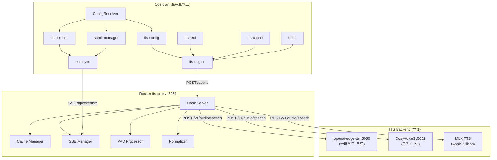

# Obsidian TTS — Obsidian 노트를 음성으로 듣는 시스템

> Obsidian 노트를 자연스러운 음성으로 변환하고, 여러 기기에서 이어 들을 수 있는 TTS 솔루션.
> Docker 한 줄이면 로컬에서 바로 시작할 수 있습니다.

[](LICENSE)

[English](README_EN.md) | **한국어**

---

## 이 프로젝트가 하는 일

1. Obsidian 노트의 텍스트를 **음성(MP3)**으로 변환합니다
2. 변환된 음성을 **캐시**해서 같은 노트를 다시 들을 때 즉시 재생합니다
3. PC, 태블릿, 스마트폰 간 **재생 위치를 실시간 동기화**합니다
4. 모든 처리가 **로컬 Docker**에서 이루어져 클라우드 비용이 없습니다

---

## 아키텍처 한눈에 보기



### 데이터 흐름 요약

```
Obsidian 노트 → tts-text (텍스트 추출)
             → tts-cache (IndexedDB 캐시 확인)
             → tts-proxy (서버 캐시 확인 → TTS 백엔드 호출)
             → VAD (무음 제거) → 캐시 저장 → 오디오 재생
```

---

## 5분 Quick Start

### 준비물

- **Docker** & **Docker Compose** ([설치 가이드](https://docs.docker.com/get-docker/))
- **Obsidian** + [Dataview 플러그인](https://github.com/blacksmithgu/obsidian-dataview) 활성화

### 1단계: 저장소 클론

```bash
git clone https://github.com/turtlesoup0/obsidian-tts.git
cd obsidian-tts
```

### 2단계: TTS 백엔드 실행

tts-proxy는 OpenAI 호환 TTS 백엔드를 필요로 합니다. 가장 간단한 무료 백엔드는
[openai-edge-tts](https://github.com/travisvn/openai-edge-tts) (Microsoft Edge TTS 프록시)입니다.

```bash
# 1) openai-edge-tts 를 자체 docker-compose 로 먼저 실행
#    → 이 과정에서 docker 네트워크 'openai-edge-tts_default' 와
#      컨테이너 'openai-edge-tts' 가 생성됩니다.
#    (openai-edge-tts 저장소의 설치 안내를 따르세요)

# 2) 백엔드 프리셋 복사 후 tts-proxy 실행 (위 네트워크에 연결)
cd docker/tts-proxy
cp .env.edge-tts.example .env.edge-tts    # 처음 한 번만
docker compose --env-file .env.edge-tts up -d
```

> 백엔드 프리셋은 시크릿이 아니지만 `.gitignore`(`.env.*`)로 로컬 전용입니다.
> 저장소에는 `.env.edge-tts.example` / `.env.cosyvoice3.example` 가 포함되어 있으니
> 복사해서 사용하세요.

> **중요**: 제공된 `docker-compose.yml`은 외부 네트워크 `openai-edge-tts_default`를
> 참조하며, 백엔드를 호스트명 `openai-edge-tts:5050`으로 찾습니다. 따라서 openai-edge-tts를
> **먼저** 실행해야 합니다.
>
> 백엔드를 호스트에서 직접 실행 중이거나 다른 포트를 쓴다면 `TTS_BACKEND_URL`을
> `http://host.docker.internal:5050` 같은 값으로 지정하세요. 이때는
> `docker-compose.yml`의 `openai-edge-tts_default` 네트워크 참조를 제거해야 합니다.

### 3단계: 동작 확인

```bash
# 헬스 체크
curl http://localhost:5051/health

# TTS 테스트 — 음성 파일 생성
curl -X POST http://localhost:5051/api/tts \
  -H "Content-Type: application/json" \
  -d '{"text":"안녕하세요. TTS 테스트입니다.","voice":"ko-KR-SunHiNeural"}' \
  --output test.mp3

# 재생 (macOS)
afplay test.mp3
```

### 4단계: Obsidian 연결

Obsidian 쪽은 **모듈형(dv.view)** 방식으로 동작합니다. 핵심 3가지:

1. `views/` 폴더를 vault의 `3_Resource/obsidian/views/` 에 복사 (경로가 코드에 하드코딩됨)
2. `3_Resource/obsidian/views/obsidian-tts-config.md` 생성 후 서버 주소(`<서버-IP>:5051`) 설정
3. 리더 노트에서 모듈을 의존성 순서로 `dv.view(...)` 로 로드 → 재생

전체 단계·정확한 경로·실제 동작 예시는 아래 [**Obsidian Vault 설정**](#obsidian-vault-설정)에 있습니다.

> 필수: [Dataview](https://github.com/blacksmithgu/obsidian-dataview) 플러그인 + "Enable JavaScript Queries" 활성화.

---

## 3가지 배포 시나리오

### A. 로컬 전용 (가장 간단)

집이나 사무실의 한 컴퓨터에서만 사용합니다.

```
Obsidian ──→ localhost:5051 (tts-proxy) ──→ localhost:5050 (edge-tts)
```

```bash
# (openai-edge-tts 가 먼저 실행 중이어야 함 — Quick Start 2단계 참조)
cd docker/tts-proxy
docker compose --env-file .env.edge-tts up -d
```

- 장점: 설정 최소, 비용 0원
- 단점: 같은 컴퓨터에서만 접근 가능

### B. 홈 네트워크 + Tailscale (권장)

여러 기기(PC, iPad, iPhone)에서 TTS를 공유합니다.

```
iPhone ──┐
iPad  ───┤── Tailscale VPN ──→ 100.x.x.x:5051 (tts-proxy)
Mac   ───┘
```

```bash
# 1. 서버와 모든 기기에 Tailscale 설치
# https://tailscale.com/download

# 2. TTS 백엔드 + tts-proxy 실행 (서버에서, Quick Start 2단계 참조)
cd docker/tts-proxy
docker compose --env-file .env.edge-tts up -d

# 3. Obsidian 설정에서 Tailscale IP 사용
# 예: http://100.107.208.106:5051
```

- 장점: 어디서든 접근, 보안(VPN), 비용 0원
- 단점: Tailscale 설정 필요

### C. 클라우드 + Cloudflare Tunnel (외부 공개)

인터넷 어디서든 접근 가능하게 합니다.

```
어디서든 ──→ https://tts.yourdomain.com ──→ Cloudflare Tunnel ──→ :5051
```

```bash
# 1. Cloudflare Tunnel 설정
cloudflared tunnel create obsidian-tts
cloudflared tunnel route dns obsidian-tts tts.yourdomain.com

# 2. config.yml 작성
# tunnel: <tunnel-id>
# ingress:
#   - hostname: tts.yourdomain.com
#     service: http://localhost:5051
#   - service: http_status:404

# 3. 실행
cloudflared tunnel run obsidian-tts
```

- 장점: HTTPS 자동, 어디서든 접근
- 단점: 도메인 필요, Cloudflare 계정

---

## TTS 백엔드 선택

tts-proxy는 **OpenAI Audio Speech API 호환** (`/v1/audio/speech`) 백엔드라면 무엇이든 연결할 수 있습니다.

| 백엔드 | 타입 | 품질 | 속도 | 비용 | 적합한 경우 |
|--------|------|------|------|------|-------------|
| **openai-edge-tts** | 클라우드 | 높음 | 빠름 | 무료 | 처음 시작하는 분 |
| **CosyVoice3** | 로컬 GPU | 매우 높음 | 보통 | 무료 | GPU가 있는 분 |
| **MLX TTS** | 로컬 Apple Silicon | 높음 | 보통 | 무료 | Mac 사용자 |

### 백엔드 전환 방법

```bash
# 프리셋은 .example 에서 복사 (처음 한 번)
cp .env.edge-tts.example .env.edge-tts
cp .env.cosyvoice3.example .env.cosyvoice3

# Edge TTS (기본)
docker compose --env-file .env.edge-tts up -d

# CosyVoice3 (로컬 GPU)
docker compose --env-file .env.cosyvoice3 up -d

# 또는 환경변수로 직접 지정 (예: MLX TTS 기본 포트 8000)
TTS_BACKEND_URL=http://host.docker.internal:8000 docker compose up -d
```

`.env` 파일 하나만 바꾸면 백엔드가 전환됩니다. 클라이언트(Obsidian) 설정은 변경 불필요.

---

## 모듈 구조

### 프론트엔드 (Obsidian Views)

Obsidian의 [Dataview](https://github.com/blacksmithgu/obsidian-dataview) 플러그인 위에서 동작하는 JavaScript 모듈들입니다.

```
views/
├── common/                    # 공용 유틸리티
│   ├── constants.js           # 전역 상수
│   ├── device-id.js           # 기기 식별자 생성
│   ├── fetch-helpers.js       # HTTP 요청 헬퍼 (타임아웃 등)
│   └── ui-helpers.js          # UI 유틸리티
│
├── tts-config/view.js         # 설정 로딩 (config 파일, Keychain, 기본값)
├── tts-core/view.js           # 핵심 초기화 (전역 네임스페이스, 로깅)
├── tts-text/view.js           # 텍스트 추출 (마크다운 제거, 볼드 강조)
├── tts-cache/view.js          # 3단계 캐시 (IndexedDB → 서버 → 새 생성)
├── tts-engine/view.js         # 재생 엔진 (play/pause/stop, iOS 백그라운드)
│   └── modules/
│       ├── audio-state-machine.js  # 오디오 상태 머신 (중단/복구)
│       └── audio-cache-resolver.js # 캐시 해결 전략
├── tts-ui/view.js             # UI 렌더링 (플레이어 컨트롤, 노트 목록)
│   └── modules/
│       ├── tts-styles.js      # CSS 스타일
│       ├── tts-usage.js       # 사용량 표시
│       └── tts-bulk.js        # 전체 노트 일괄 생성
├── tts-position/view.js       # 재생 위치 동기화
├── tts-debug/view.js          # 디버그 패널
├── sse-sync/view.js           # SSE 실시간 동기화 클라이언트
├── scroll-manager/view.js     # 스크롤 위치 동기화
└── integrated-ui/view.js      # 통합 노트 UI
```

#### 모듈 로드 순서

```
tts-core → tts-config → tts-text → tts-cache → tts-engine → tts-ui
                                                     ↑
                                              tts-position
                                              sse-sync
                                              scroll-manager
```

### 백엔드 (Docker tts-proxy)

```
docker/tts-proxy/
├── server.py          # Flask 메인 서버 (18개 엔드포인트)
├── cache_manager.py   # 파일 기반 캐시 + 통계
├── sse_manager.py     # SSE 브로드캐스트 (인메모리/Redis)
├── vad_processor.py   # Silero VAD 무음 트리밍
├── normalizer.py      # 영문 축약어 발음 정규화
├── requirements.txt   # Python 의존성
├── Dockerfile
├── docker-compose.yml
├── .env.edge-tts      # Edge TTS 프리셋
└── .env.cosyvoice3    # CosyVoice3 프리셋
```

### 설정 시스템 (두 계층)

설정은 두 계층으로 나뉩니다. 코드를 그대로 반영하면:

**1) 리더 TTS 설정 — `views/tts-config/view.js`**
TTS 엔드포인트·음성·캐시 옵션은 `obsidian-tts-config.md`의 `window.ObsidianTTSConfig`에서 로드합니다(파일이 없으면 코드 내 기본값 사용). `operationMode`(`local`/`server`/`hybrid`)가 `TTS_OPERATION_MODES`(tts-config/view.js)에 정의되어 TTS 엔드포인트를 결정합니다:

| Mode | TTS | 캐시 | 위치 동기화 |
|------|-----|------|------------|
| `local` | 로컬 | 로컬 | 로컬 |
| `server` | Azure | Azure | Azure (레거시) |
| `hybrid` | 로컬 | 하이브리드 | 로컬 (Cloudflare/Tailscale 경유) |

**2) 동기화 엔드포인트 해석 — `shared/configResolver.js` (SPEC-ARCH-001)**
재생위치·스크롤·SSE 모듈(`tts-position`, `scroll-manager`, `sse-sync`)이 참조하도록 설계된 별도 모듈로, 4가지 소스를 우선순위로 병합합니다:

| 우선순위 | 소스 | 설명 |
|---------|------|------|
| 1 (최우선) | Runtime Config | `window.ttsEndpointConfig` 직접 설정 |
| 2 | Config File | `obsidian-tts-config.md` 파일 |
| 3 | Keychain | Obsidian Keychain API (`shared/configResolver.js`의 `_loadKeychainConfig`) |
| 4 (폴백) | Defaults | 하드코딩된 기본값 |

> 두 계층은 별개입니다. 메인 리더(tts-config)는 1번 경로로 설정을 읽고, 동기화 엔드포인트는 ConfigResolver(2번)가 해석합니다. Keychain은 ConfigResolver 모듈에만 존재합니다(리더 설정 로더에는 없음).

---

## API 엔드포인트 레퍼런스

### TTS 생성

| 메서드 | 경로 | 설명 |
|--------|------|------|
| `GET` | `/api/tts?text=...&voice=...` | TTS 생성 (쿼리 파라미터) |
| `POST` | `/api/tts` | TTS 생성 (JSON body) |
| `POST` | `/api/tts-stream` | TTS 생성 (Azure 호환) |
| `POST` | `/v1/audio/speech` | TTS 생성 (OpenAI 호환) |

**POST /api/tts 요청 예시:**
```json
{
  "text": "안녕하세요. TTS 테스트입니다.",
  "voice": "ko-KR-SunHiNeural",
  "rate": 1.0,
  "useCache": true
}
```

**지원 음성:**
- 한국어 (9종): `ko-KR-SunHiNeural`(여성, 기본), `ko-KR-InJoonNeural`, `ko-KR-BongJinNeural`, `ko-KR-GookMinNeural`, `ko-KR-JiMinNeural`, `ko-KR-SeoHyeonNeural`, `ko-KR-SoonBokNeural`, `ko-KR-YuJinNeural`, `ko-KR-HyunsuNeural`
- 영어: `en-US-JennyNeural`, `en-US-GuyNeural`, `en-US-AriaNeural`
- 범용: `alloy`, `echo`, `fable`, `onyx`, `nova`, `shimmer`

**응답:** `audio/mpeg` 바이너리 + 헤더 `X-Cache: HIT|MISS`

### 캐시 관리

| 메서드 | 경로 | 설명 |
|--------|------|------|
| `GET` | `/api/cache/<key>` | 캐시 조회 |
| `PUT` | `/api/cache/<key>` | 캐시 저장 |
| `DELETE` | `/api/cache/<key>` | 캐시 삭제 |
| `DELETE` | `/api/cache-clear` | 전체 캐시 삭제 |

### 동기화 (SSE + REST)

| 메서드 | 경로 | 설명 |
|--------|------|------|
| `GET` | `/api/events/playback` | 재생 위치 SSE 스트림 |
| `GET` | `/api/events/scroll` | 스크롤 위치 SSE 스트림 |
| `GET` | `/api/playback-position` | 재생 위치 조회 |
| `PUT` | `/api/playback-position` | 재생 위치 저장 + SSE 브로드캐스트 |
| `GET` | `/api/scroll-position` | 스크롤 위치 조회 |
| `PUT` | `/api/scroll-position` | 스크롤 위치 저장 + SSE 브로드캐스트 |

### 통계/헬스

| 메서드 | 경로 | 설명 |
|--------|------|------|
| `GET` | `/health` | 서버 상태 (SSE 클라이언트 수, VAD 상태 등) |
| `GET` | `/api/stats` | 요청 통계 |
| `GET` | `/api/usage` | 일별 사용량 |
| `GET` | `/api/cache-stats` | 캐시 히트율, 파일 수, 총 크기 |

---

## Obsidian Vault 설정

> **중요 — 경로 규칙이 코드에 하드코딩되어 있습니다.**
> - 리더 노트는 `dv.view("views/<모듈>")` 로 모듈을 호출합니다 (Dataview가 vault 루트 기준으로 해석).
> - 동시에 `tts-config/view.js`·`tts-engine/view.js`·`tts-ui/view.js`·`integrated-ui/view.js` 는
>   설정 파일과 보조 모듈을 **`3_Resource/obsidian/views/`** 경로에서 로드합니다 (하드코딩).
>
> 다른 vault 레이아웃을 쓰려면 위 4개 파일의 하드코딩 경로를 직접 수정해야 합니다.
> 아래 안내는 작성자의 실제 동작 구조(`3_Resource/obsidian/views/`)를 기준으로 합니다.

### 1. 모듈 설치

`views/` 폴더 전체를 vault의 `3_Resource/obsidian/views/` 아래로 복사합니다:

```bash
VAULT="$HOME/obsidian/my-vault"
mkdir -p "$VAULT/3_Resource/obsidian"
cp -r views "$VAULT/3_Resource/obsidian/views"
```

### 2. 설정 파일 생성

`<vault 루트>/3_Resource/obsidian/views/obsidian-tts-config.md` 를 생성합니다
(이 경로는 `tts-config/view.js:31` 에 하드코딩되어 있습니다 — vault 루트가 아닙니다):

````markdown
---
해시태그: "#tts-config"
---

```dataviewjs
window.ObsidianTTSConfig = {
    operationMode: 'local',           // local | server | hybrid
    localEdgeTtsUrl: 'http://<서버-IP>:5051/api/tts',
    edgeServerUrl: 'http://<서버-IP>:5051',
    ttsEndpoint: '/api/tts-stream',
    cacheEndpoint: '/api/cache',
    playbackPositionEndpoint: '/api/playback-position',
    scrollPositionEndpoint: '/api/scroll-position',
    defaultVoice: 'ko-KR-SunHiNeural',
    defaultRate: 1.0,
    enableOfflineCache: true,
    cacheTtlDays: 30,
    debugMode: false
};
```
````

> **보안 검증**: `tts-config/view.js` 는 이 블록을 화이트리스트로 검사 후 실행합니다
> (`eval`/`fetch`/`import`/`setTimeout` 등 금지, `window.ObsidianTTSConfig = {...}` 할당만 허용).
>
> `<서버-IP>`: 로컬=`localhost` · Tailscale=`100.x.x.x` · Cloudflare=`https://tts.yourdomain.com`

### 3. 리더 노트 작성

새 노트에 아래 dataviewjs 블록을 넣습니다. **모듈을 의존성 순서로 로드**한 뒤 페이지를 조회해
엔진·UI에 전달합니다 (작성자의 실제 운영 노트와 동일한 구조):

````markdown
```dataviewjs
// 모듈 로딩 (의존성 순서)
await dv.view("views/tts-core");      // 공유 유틸리티
await dv.view("views/tts-config");    // 설정 로딩
await dv.view("views/tts-text");      // 텍스트 정제
await dv.view("views/tts-cache");     // 3단계 캐시
await dv.view("views/tts-position");  // 재생 위치 동기화

// 읽을 노트 선택 (폴더·태그를 본인 환경에 맞게 수정)
const pages = dv.pages('"내폴더/경로" and -#검색제외 and #읽기대상')
    .sort(b => [b.file.folder, b.file.name], 'asc')
    .array();

// 엔진 + UI (pages 전달)
await dv.view("views/tts-engine", { pages });
await dv.view("views/tts-ui", { pages, dv });
```
````

> `dv.view("views/...")` 의 `views/` 는 Dataview가 vault 루트 기준으로 해석합니다.
> 모듈을 `3_Resource/obsidian/views/` 에 두었다면 Dataview 설정/경로를 그에 맞게 조정하거나
> 위 "경로 규칙" 안내대로 코드 경로를 수정하세요.

### 4. 읽을 노트의 frontmatter 계약

리더가 노트를 음성으로 변환할 때 사용하는 필드:

```markdown
---
정의: 이 노트의 핵심 정의 (TTS 본문에 포함)
키워드: ["키워드1", "키워드2"]
---
```

- `정의`·`키워드` 는 TTS 본문 생성 및 캐시 키 계산에 사용됩니다.
- 어떤 노트가 목록에 들어갈지는 위 `dv.pages(...)` 쿼리(폴더·태그 필터)가 결정합니다.

### 5. 필수 Obsidian 플러그인

- **[Dataview](https://github.com/blacksmithgu/obsidian-dataview)**: 모듈 실행 엔진
  - Community Plugins → "Dataview" 설치
  - Dataview 설정에서 **"Enable JavaScript Queries"** 활성화 필수

### 레거시 템플릿 주의

`templates/tts-reader.md` 와 `templates/sample-tts-note.md` 는 **옛 Azure 기반(v5) 예시**입니다
(`azureFunctionUrl`·Azure Blob 캐시 가정). 현재 로컬 Docker 구조에서는 위 모듈형 방식을 사용하세요.
레거시 파일은 참고용으로만 남겨두었습니다.

---

## 주요 기능 상세

### 3단계 캐싱

```
1. IndexedDB (오프라인) → 가장 빠름, 기기별 저장
2. 서버 캐시 (tts-proxy) → 기기 간 공유
3. TTS 백엔드 생성 → 캐시 없을 때만 호출
```

### SSE 실시간 동기화

폴링(5초 간격) 대신 **Server-Sent Events**로 100ms 이내 동기화:

```
기기 A: 42번 노트 재생 중 → PUT /api/playback-position
                           → SSE 브로드캐스트
기기 B: SSE 수신 → 자동으로 42번 노트 위치로 이동
```

### VAD 무음 제거

Silero VAD 모델이 TTS 출력의 앞뒤 불필요한 무음/숨소리를 자동 제거합니다.

### 영문 축약어 정규화

edge-tts가 `JWT`, `HTTP`, `API` 같은 약어를 뭉개는 문제를 해결:

```
JWT  → J W T  (글자별 분리)
API  → A P I  (forcelist)
JSON → JSON   (단어로 발음, whitelist)
```

사전은 `data/acronym-dict.json`에 저장되며, `scripts/rebuild-dict.sh`로 vault에서 자동 수집합니다.

### iOS 백그라운드 재생

iPhone/iPad에서 다른 앱으로 전환해도 재생이 계속됩니다:

- `visibilitychange` 이벤트 기반 백그라운드 감지
- 오디오 세션 유지를 위한 3중 가드 패턴
- `AudioPlaybackWatchdog`로 상태 불일치 자동 복구

---

## 환경변수 레퍼런스 (tts-proxy)

| 변수 | 기본값 | 설명 |
|------|--------|------|
| `TTS_BACKEND_URL` | `http://localhost:5050` | TTS 백엔드 주소 |
| `TTS_MODEL` | (빈 값) | 모델명 오버라이드 (MLX 등) |
| `TTS_TIMEOUT` | `120` | 백엔드 요청 타임아웃 (초) |
| `TTS_MAX_RETRIES` | `3` | 재시도 횟수 |
| `TTS_DISABLE_INTERNAL_CACHE` | `false` | 백엔드 전환 시 캐시 우회 |
| `TTS_NORMALIZE_ENABLED` | `false` | 축약어 정규화 활성화 |
| `TTS_NORMALIZE_DICT_PATH` | `/app/data/acronym-dict.json` | 축약어 사전 경로 |
| `CORS_ORIGINS` | `app://obsidian.md,http://localhost:*,http://127.0.0.1:*` | CORS 허용 출처 (`*`=전체) |
| `REDIS_ENABLED` | `false` | Redis SSE 모드 |
| `REDIS_HOST` | `localhost` | Redis 호스트 |
| `REDIS_PORT` | `6379` | Redis 포트 |
| `TTS_PROXY_PORT` | `5051` | 서버 포트 |
| `TTS_DATA_DIR` | `./data/tts-cache` | 데이터 저장 경로 |

> 위 기본값은 `server.py`가 환경변수 부재 시 사용하는 **코드 기본값**입니다.
> 제공된 docker-compose 프리셋(`.env.edge-tts` 등)은 일부 값을 덮어씁니다:
> `TTS_BACKEND_URL`→`openai-edge-tts:5050`, `TTS_NORMALIZE_ENABLED`→`true`, `CORS_ORIGINS`→`*`

---

## 문제 해결

### 음성이 생성되지 않는 경우

```bash
# 1. tts-proxy 헬스 체크
curl http://localhost:5051/health

# 2. TTS 백엔드 직접 테스트
curl -X POST http://localhost:5050/v1/audio/speech \
  -H "Content-Type: application/json" \
  -d '{"model":"tts-1","input":"테스트","voice":"alloy"}' \
  --output test.mp3

# 3. Docker 로그 확인
docker logs obsidian-tts-proxy
```

### Obsidian에서 연결이 안 되는 경우

1. 브라우저 콘솔 (F12 → Console)에서 빨간 에러 확인
2. `obsidian-tts-config.md`의 서버 주소가 정확한지 확인
3. CORS 설정 확인 (Obsidian → `app://obsidian.md`)
4. 방화벽에서 5051 포트가 열려있는지 확인

### 캐시를 초기화하고 싶은 경우

```bash
# 서버 캐시 전체 삭제
curl -X DELETE http://localhost:5051/api/cache-clear

# IndexedDB 캐시 (Obsidian 콘솔에서)
indexedDB.deleteDatabase('obsidian-tts-offline');
```

---

## 프로젝트 구조 전체

```
obsidian-tts/
├── docker/tts-proxy/          # 메인 백엔드 서버 (Python/Flask)
├── views/                     # Obsidian 프론트엔드 모듈 (JavaScript)
├── shared/                    # 레거시 공유 모듈 (configResolver 등)
├── src/functions/             # 레거시 Azure Functions (비활성)
├── templates/                 # Obsidian 템플릿 파일
├── scripts/
│   ├── sync-to-vault.sh       # Projects → vault 단방향 동기화
│   ├── rebuild-dict.sh        # 축약어 사전 재빌드
│   └── setup-obsidian.sh      # Obsidian 자동 설정 (레거시)
├── docs/                      # 추가 문서
├── README.md                  # 이 파일
├── README_EN.md               # English version
├── CHANGELOG.md               # 변경 이력
└── CONTRIBUTING.md            # 기여 가이드
```

---

## 기여하기

이슈 리포트나 Pull Request를 환영합니다!

1. Fork
2. Feature branch 생성 (`git checkout -b feat/my-feature`)
3. 커밋 (`git commit -m 'feat: Add my feature'`)
4. Push (`git push origin feat/my-feature`)
5. Pull Request 생성

---

## 라이선스

MIT License. [LICENSE](LICENSE) 참조.

---

**저장소**: [github.com/turtlesoup0/obsidian-tts](https://github.com/turtlesoup0/obsidian-tts)
**최종 업데이트**: 2026-05-29
