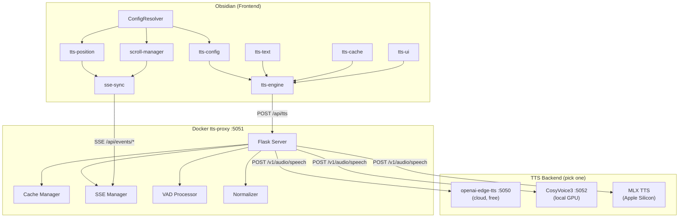

# Obsidian TTS — Listen to Your Obsidian Notes

> Convert Obsidian notes to natural speech and seamlessly resume playback across devices.
> One Docker command to get started locally.

[](LICENSE)

**English** | [한국어](README.md)

---

## What This Project Does

1. Converts Obsidian note text into **speech (MP3)**
2. **Caches** converted audio for instant replay of the same note
3. **Syncs playback position in real-time** across PC, tablet, and smartphone
4. Everything runs in **local Docker** — zero cloud costs

---

## Architecture at a Glance



### Data Flow Summary

```
Obsidian note  -> tts-text (extract text)
               -> tts-cache (check IndexedDB cache)
               -> tts-proxy (check server cache -> call TTS backend)
               -> VAD (trim silence) -> save to cache -> play audio
```

---

## 5-Minute Quick Start

### Prerequisites

- **Docker** & **Docker Compose** ([install guide](https://docs.docker.com/get-docker/))
- **Obsidian** with [Dataview plugin](https://github.com/blacksmithgu/obsidian-dataview) enabled

### Step 1: Clone the Repository

```bash
git clone https://github.com/turtlesoup0/obsidian-tts.git
cd obsidian-tts
```

### Step 2: Start the TTS Backend

tts-proxy requires an OpenAI-compatible TTS backend. The simplest free backend is
[openai-edge-tts](https://github.com/travisvn/openai-edge-tts) (a Microsoft Edge TTS proxy).

```bash
# 1) Start openai-edge-tts via its own docker-compose first
#    -> This creates the docker network 'openai-edge-tts_default'
#       and a container named 'openai-edge-tts'.
#    (Follow the openai-edge-tts repo's setup instructions)

# 2) Copy the backend preset, then start tts-proxy (joins the network above)
cd docker/tts-proxy
cp .env.edge-tts.example .env.edge-tts    # first time only
docker compose --env-file .env.edge-tts up -d
```

> The backend presets are not secrets, but `.gitignore` (`.env.*`) keeps them local.
> The repo ships `.env.edge-tts.example` / `.env.cosyvoice3.example` — copy them to use.

> **Important**: The provided `docker-compose.yml` references the external network
> `openai-edge-tts_default` and resolves the backend via hostname `openai-edge-tts:5050`.
> So openai-edge-tts must be running **first**.
>
> If you run the backend directly on the host or on a different port, set `TTS_BACKEND_URL`
> to something like `http://host.docker.internal:5050`. In that case, remove the
> `openai-edge-tts_default` network reference from `docker-compose.yml`.

### Step 3: Verify It Works

```bash
# Health check
curl http://localhost:5051/health

# TTS test — generate an audio file
curl -X POST http://localhost:5051/api/tts \
  -H "Content-Type: application/json" \
  -d '{"text":"Hello. This is a TTS test.","voice":"en-US-JennyNeural"}' \
  --output test.mp3

# Play (macOS)
afplay test.mp3
```

### Step 4: Connect Obsidian

The Obsidian side runs in a **modular (dv.view)** fashion. Three essentials:

1. Copy the `views/` folder to your vault's `3_Resource/obsidian/views/` (path is hardcoded in the code)
2. Create `3_Resource/obsidian/views/obsidian-tts-config.md` and set your server address (`<server-IP>:5051`)
3. In a reader note, load modules in dependency order via `dv.view(...)` -> play

Full steps, exact paths, and a real working example are in [**Obsidian Vault Setup**](#obsidian-vault-setup) below.

> Required: [Dataview](https://github.com/blacksmithgu/obsidian-dataview) plugin + "Enable JavaScript Queries".

---

## 3 Deployment Scenarios

### A. Local Only (Simplest)

Use on a single computer at home or office.

```
Obsidian --> localhost:5051 (tts-proxy) --> localhost:5050 (edge-tts)
```

```bash
# (openai-edge-tts must already be running — see Quick Start Step 2)
cd docker/tts-proxy
docker compose --env-file .env.edge-tts up -d
```

- Pros: Minimal setup, zero cost
- Cons: Single machine only

### B. Home Network + Tailscale (Recommended)

Share TTS across multiple devices (PC, iPad, iPhone).

```
iPhone --+
iPad  ---+-- Tailscale VPN --> 100.x.x.x:5051 (tts-proxy)
Mac   ---+
```

```bash
# 1. Install Tailscale on server and all devices
# https://tailscale.com/download

# 2. Start TTS backend + tts-proxy (on server, see Quick Start Step 2)
cd docker/tts-proxy
docker compose --env-file .env.edge-tts up -d

# 3. Use Tailscale IP in Obsidian config
# e.g., http://100.107.208.106:5051
```

- Pros: Access anywhere, secure (VPN), zero cost
- Cons: Requires Tailscale setup

### C. Cloud + Cloudflare Tunnel (Public Access) — ⚠️ Advanced / use caution

Make it accessible from anywhere on the internet.

> ⚠️ **Security warning:** this tts-proxy has **no authentication**. Cloudflare Tunnel only
> provides HTTPS, not auth — so anyone who learns the hostname can wipe the cache
> (`DELETE /api/cache-clear`) or drive unlimited synthesis against your backend. If you truly
> need public exposure, **put an auth layer in front (Cloudflare Access, mTLS, or a shared-secret
> header).** Otherwise prefer Scenario B (Tailscale) for remote access. Also, do NOT use
> `CORS_ORIGINS=*` when exposing publicly (see the CORS entry below).

```
Anywhere --> https://tts.yourdomain.com --> Cloudflare Tunnel --> :5051
```

```bash
# 1. Set up Cloudflare Tunnel
cloudflared tunnel create obsidian-tts
cloudflared tunnel route dns obsidian-tts tts.yourdomain.com

# 2. Create config.yml
# tunnel: <tunnel-id>
# ingress:
#   - hostname: tts.yourdomain.com
#     service: http://localhost:5051
#   - service: http_status:404

# 3. Run
cloudflared tunnel run obsidian-tts
```

- Pros: Automatic HTTPS, access from anywhere
- Cons: Requires domain, Cloudflare account, **you must add an auth layer yourself (do not expose publicly without one)**

---

## Choosing a TTS Backend

tts-proxy works with any **OpenAI Audio Speech API compatible** (`/v1/audio/speech`) backend.

| Backend | Type | Quality | Speed | Cost | Best For |
|---------|------|---------|-------|------|----------|
| **openai-edge-tts** | Cloud | High | Fast | Free | Getting started |
| **CosyVoice3** | Local GPU | Very High | Medium | Free | GPU owners |
| **MLX TTS** | Local Apple Silicon | High | Medium | Free | Mac users |

### Switching Backends

```bash
# Copy presets from .example (first time)
cp .env.edge-tts.example .env.edge-tts
cp .env.cosyvoice3.example .env.cosyvoice3

# Edge TTS (default)
docker compose --env-file .env.edge-tts up -d

# CosyVoice3 (local GPU)
docker compose --env-file .env.cosyvoice3 up -d

# Or specify directly via environment variable (e.g. MLX TTS default port 8000)
TTS_BACKEND_URL=http://host.docker.internal:8000 docker compose up -d
```

Just swap one `.env` file — no client-side (Obsidian) changes needed.

---

## Module Structure

### Frontend (Obsidian Views)

JavaScript modules running on Obsidian's [Dataview](https://github.com/blacksmithgu/obsidian-dataview) plugin.

```
views/
+-- common/                    # Shared utilities
|   +-- constants.js           # Global constants
|   +-- device-id.js           # Device identifier
|   +-- fetch-helpers.js       # HTTP helpers (timeout, etc.)
|   +-- ui-helpers.js          # UI utilities
|
+-- tts-config/view.js         # Config loading (file, Keychain, defaults)
+-- tts-core/view.js           # Core init (global namespace, logging)
+-- tts-text/view.js           # Text extraction (markdown strip, bold emphasis)
+-- tts-cache/view.js          # 3-tier cache (IndexedDB -> server -> generate)
+-- tts-engine/view.js         # Playback engine (play/pause/stop, iOS background)
|   +-- modules/
|       +-- audio-state-machine.js  # Audio state machine (interrupt/recovery)
|       +-- audio-cache-resolver.js # Cache resolution strategy
+-- tts-ui/view.js             # UI rendering (player controls, note list)
|   +-- modules/
|       +-- tts-styles.js      # CSS styles
|       +-- tts-usage.js       # Usage display
|       +-- tts-bulk.js        # Bulk generation
+-- tts-position/view.js       # Playback position sync
+-- tts-debug/view.js          # Debug panel
+-- sse-sync/view.js           # SSE real-time sync client
+-- scroll-manager/view.js     # Scroll position sync
+-- integrated-ui/view.js      # Integrated note UI
```

#### Module Load Order

```
tts-core -> tts-config -> tts-text -> tts-cache -> tts-engine -> tts-ui
                                                        ^
                                                 tts-position
                                                 sse-sync
                                                 scroll-manager
```

### Backend (Docker tts-proxy)

```
docker/tts-proxy/
+-- server.py          # Flask main server (18 endpoints)
+-- cache_manager.py   # File-based cache + statistics
+-- sse_manager.py     # SSE broadcast (in-memory / Redis)
+-- vad_processor.py   # Silero VAD silence trimming
+-- normalizer.py      # English acronym pronunciation normalization
+-- requirements.txt   # Python dependencies
+-- Dockerfile
+-- docker-compose.yml
+-- .env.edge-tts      # Edge TTS preset
+-- .env.cosyvoice3    # CosyVoice3 preset
```

### Config System (Two Layers)

Configuration splits into two layers, reflecting the actual code:

**1) Reader TTS config — `views/tts-config/view.js`**
TTS endpoint / voice / cache options load from `window.ObsidianTTSConfig` in `obsidian-tts-config.md` (falls back to in-code defaults if absent). `operationMode` (`local`/`server`/`hybrid`) is defined in `TTS_OPERATION_MODES` (tts-config/view.js) and selects the TTS endpoint:

| Mode | TTS | Cache | Position sync |
|------|-----|-------|---------------|
| `local` | local | local | local |
| `server` | Azure | Azure | Azure (legacy) |
| `hybrid` | local | hybrid | local (via Cloudflare/Tailscale) |

**2) Sync endpoint resolution — `shared/configResolver.js` (SPEC-ARCH-001)**
A separate module that the position/scroll/SSE modules (`tts-position`, `scroll-manager`, `sse-sync`) reference, merging 4 sources by priority:

| Priority | Source | Description |
|----------|--------|-------------|
| 1 (highest) | Runtime Config | `window.ttsEndpointConfig` |
| 2 | Config File | `obsidian-tts-config.md` file |
| 3 | Keychain | Obsidian Keychain API (`_loadKeychainConfig` in `shared/configResolver.js`) |
| 4 (fallback) | Defaults | Hardcoded default values |

> The two layers are separate. The main reader (tts-config) reads settings via layer 1; sync endpoints are resolved by ConfigResolver (layer 2). Keychain exists only in the ConfigResolver module (not in the reader's config loader).

---

## API Endpoint Reference

### TTS Generation

| Method | Path | Description |
|--------|------|-------------|
| `GET` | `/api/tts?text=...&voice=...` | Generate TTS (query params) |
| `POST` | `/api/tts` | Generate TTS (JSON body) |
| `POST` | `/api/tts-stream` | Generate TTS (Azure compatible) |
| `POST` | `/v1/audio/speech` | Generate TTS (OpenAI compatible) |

**POST /api/tts example:**
```json
{
  "text": "Hello. This is a TTS test.",
  "voice": "en-US-JennyNeural",
  "rate": 1.0,
  "useCache": true
}
```

**Supported voices:**
- Korean (9 voices): `ko-KR-SunHiNeural` (female, default), `ko-KR-InJoonNeural`, `ko-KR-BongJinNeural`, `ko-KR-GookMinNeural`, `ko-KR-JiMinNeural`, `ko-KR-SeoHyeonNeural`, `ko-KR-SoonBokNeural`, `ko-KR-YuJinNeural`, `ko-KR-HyunsuNeural`
- English: `en-US-JennyNeural`, `en-US-GuyNeural`, `en-US-AriaNeural`
- Generic: `alloy`, `echo`, `fable`, `onyx`, `nova`, `shimmer`

**Response:** `audio/mpeg` binary + header `X-Cache: HIT|MISS`

### Cache Management

| Method | Path | Description |
|--------|------|-------------|
| `GET` | `/api/cache/<key>` | Get cached audio |
| `PUT` | `/api/cache/<key>` | Store audio in cache |
| `DELETE` | `/api/cache/<key>` | Delete cached audio |
| `DELETE` | `/api/cache-clear` | Clear all cache |

### Sync (SSE + REST)

| Method | Path | Description |
|--------|------|-------------|
| `GET` | `/api/events/playback` | Playback position SSE stream |
| `GET` | `/api/events/scroll` | Scroll position SSE stream |
| `GET` | `/api/playback-position` | Get playback position |
| `PUT` | `/api/playback-position` | Save position + SSE broadcast |
| `GET` | `/api/scroll-position` | Get scroll position |
| `PUT` | `/api/scroll-position` | Save position + SSE broadcast |

### Stats & Health

| Method | Path | Description |
|--------|------|-------------|
| `GET` | `/health` | Server status (SSE clients, VAD status, etc.) |
| `GET` | `/api/stats` | Request statistics |
| `GET` | `/api/usage` | Daily usage |
| `GET` | `/api/cache-stats` | Cache hit rate, file count, total size |

---

## Obsidian Vault Setup

> **IMPORTANT — path rules are hardcoded in the code.**
> - `tts-config/view.js`, `tts-engine/view.js`, `tts-ui/view.js`, and `integrated-ui/view.js`
>   load the config file and helper modules from **`3_Resource/obsidian/views/`** (hardcoded).
> - Therefore your reader note's `dv.view(...)` must also use the **same full path
>   `3_Resource/obsidian/views/<module>`** so both resolve to one place (the `dv.view` argument is
>   resolved relative to the vault root).
>
> The steps below use `3_Resource/obsidian/views/` as the single source of truth.
> To use a different location you must change BOTH the `dv.view` arguments and the hardcoded paths in
> those 4 files (see the note at the end of step 3).

### 1. Install Modules

Copy the entire `views/` folder under your vault's `3_Resource/obsidian/views/`:

```bash
VAULT="$HOME/obsidian/my-vault"
mkdir -p "$VAULT/3_Resource/obsidian"
cp -r views "$VAULT/3_Resource/obsidian/views"
```

### 2. Create the Config File

Create `<vault root>/3_Resource/obsidian/views/obsidian-tts-config.md`
(this path is hardcoded at `tts-config/view.js:31` — NOT the vault root):

````markdown
---
hashtag: "#tts-config"
---

```dataviewjs
window.ObsidianTTSConfig = {
    operationMode: 'local',           // local | server | hybrid
    localEdgeTtsUrl: 'http://<server-IP>:5051/api/tts',
    edgeServerUrl: 'http://<server-IP>:5051',
    ttsEndpoint: '/api/tts-stream',
    cacheEndpoint: '/api/cache',
    playbackPositionEndpoint: '/api/playback-position',
    scrollPositionEndpoint: '/api/scroll-position',
    defaultVoice: 'ko-KR-SunHiNeural',
    defaultRate: 1.0,
    enableOfflineCache: true,
    cacheTtlDays: 30,
    debugMode: false
};
```
````

> **Security check**: `tts-config/view.js` validates this block against a whitelist before executing
> (`eval`/`fetch`/`import`/`setTimeout` etc. forbidden; only a `window.ObsidianTTSConfig = {...}` assignment allowed).
>
> `<server-IP>`: local=`localhost` · Tailscale=`100.x.x.x` · Cloudflare=`https://tts.yourdomain.com`

### 3. Write a Reader Note

Put the dataviewjs block below into a new note. It **loads modules in dependency order**, then queries
pages and passes them to the engine/UI (identical to the author's actual working note):

````markdown
```dataviewjs
// Module loading (dependency order). dv.view paths are vault-root relative, so
// use the full path where you copied the modules in step 1 (3_Resource/obsidian/views/).
await dv.view("3_Resource/obsidian/views/tts-core");      // shared utilities
await dv.view("3_Resource/obsidian/views/tts-config");    // config loading
await dv.view("3_Resource/obsidian/views/tts-text");      // text cleaning
await dv.view("3_Resource/obsidian/views/tts-cache");     // 3-tier cache
await dv.view("3_Resource/obsidian/views/tts-position");  // playback position sync

// Select notes to read (edit folder/tag for your setup)
const pages = dv.pages('"MyFolder/Path" and -#exclude and #readable')
    .sort(b => [b.file.folder, b.file.name], 'asc')
    .array();

// Engine + UI (pass pages)
await dv.view("3_Resource/obsidian/views/tts-engine", { pages });
await dv.view("3_Resource/obsidian/views/tts-ui", { pages, dv });
```
````

> **Keep the path consistent.** The `dv.view(...)` argument is resolved by Dataview **relative to the
> vault root**, while the module code (`tts-config`/`tts-engine`/`tts-ui`/`integrated-ui`) loads helper
> modules and the config file from **`3_Resource/obsidian/views/`** (hardcoded). So if you copy the
> modules to `3_Resource/obsidian/views/` AND use the **full path** in `dv.view` as above, both resolve
> to the same place and it just works. To use a different location (e.g. vault-root `views/`), change
> **both** the `dv.view` arguments and the hardcoded paths in those 4 files — changing only one side
> silently causes 404 module loads or missing config/helper-module failures.

### 4. Note Frontmatter Contract

Fields the reader uses when converting a note to speech:

```markdown
---
정의: the note's core definition (included in TTS text)
키워드: ["keyword1", "keyword2"]
---
```

- `정의` (definition) and `키워드` (keywords) feed TTS text generation and the cache key.
- Which notes appear in the list is decided by the `dv.pages(...)` query (folder/tag filter) above.

### 5. Required Obsidian Plugin

- **[Dataview](https://github.com/blacksmithgu/obsidian-dataview)**: module execution engine
  - Community Plugins -> "Dataview" -> Install
  - Must enable **"Enable JavaScript Queries"** in Dataview settings

### Legacy Templates Notice

`templates/tts-reader.md` and `templates/sample-tts-note.md` are **legacy Azure-era (v5) examples**
(they assume `azureFunctionUrl` and Azure Blob caching). For the current local-Docker setup, use the
modular approach above. The legacy files are kept for reference only.

---

## Key Features in Detail

### 3-Tier Caching

```
1. IndexedDB (offline) -> fastest, per-device storage
2. Server cache (tts-proxy) -> shared across devices
3. TTS backend generation -> called only when no cache exists
```

### SSE Real-Time Sync

Instead of polling (5-second intervals), **Server-Sent Events** sync within 100ms:

```
Device A: Playing note #42 -> PUT /api/playback-position
                            -> SSE broadcast
Device B: SSE received -> automatically jump to note #42 position
```

### VAD Silence Trimming

Silero VAD model automatically removes unnecessary silence and breath sounds from TTS output.

### English Acronym Normalization

Fixes edge-tts garbling acronyms like `JWT`, `HTTP`, `API`:

```
JWT  -> J W T   (letter-by-letter split)
JWTs -> J W T s (plurals handled too)
API  -> A P I   (force list)
JSON -> JSON    (pronounced as word, whitelist)
```

Active only when `TTS_NORMALIZE_ENABLED=true` (off by default), and it **works without a dictionary
in heuristic-only mode**. Optionally point `TTS_NORMALIZE_DICT_PATH` (default `data/acronym-dict.json`)
at a vault acronym dictionary to take precedence. The batch pipeline that builds/refreshes that
dictionary is out of scope for this repo; when absent, normalization gracefully degrades to the
built-in heuristics (whitelist / force-list / vowel ratio).

### iOS Background Playback

Playback continues when switching apps on iPhone/iPad:

- `visibilitychange` event-based background detection
- Triple guard pattern for audio session preservation
- `AudioPlaybackWatchdog` for automatic state mismatch recovery

---

## Environment Variables Reference (tts-proxy)

| Variable | Default | Description |
|----------|---------|-------------|
| `TTS_BACKEND_URL` | `http://localhost:5050` | TTS backend address |
| `TTS_MODEL` | (empty) | Model name override (for MLX, etc.) |
| `TTS_TIMEOUT` | `120` | Backend request timeout (seconds) |
| `TTS_MAX_RETRIES` | `3` | Retry count |
| `TTS_DISABLE_INTERNAL_CACHE` | `false` | Bypass cache on backend switch |
| `TTS_NORMALIZE_ENABLED` | `false` | Enable acronym normalization |
| `TTS_NORMALIZE_DICT_PATH` | `/app/data/acronym-dict.json` | Acronym dictionary path |
| `CORS_ORIGINS` | `app://obsidian.md,capacitor://localhost,http://localhost:*,http://127.0.0.1:*` | Allowed CORS origins. `host:*` is converted by server.py into an anchored regex (port-only wildcard). `*`=all (private network only) |
| `REDIS_ENABLED` | `false` | Redis SSE mode |
| `REDIS_HOST` | `localhost` | Redis host |
| `REDIS_PORT` | `6379` | Redis port |
| `TTS_PROXY_PORT` | `5051` | Server port |
| `TTS_DATA_DIR` | `./data/tts-cache` | Data storage path |

> The defaults above are the **code defaults** used by `server.py` when the variable is absent.
> At runtime some are overridden:
> - `docker-compose.yml` itself supplies the `TTS_BACKEND_URL`→`openai-edge-tts:5050` default and
>   **pins** `CORS_ORIGINS` to the Obsidian/local allowlist (same as the server.py code default).
> - The `.env.edge-tts` preset additionally supplies `TTS_TIMEOUT`, `TTS_MODEL`, and `TTS_MAX_RETRIES`.
>
> Normalization is opt-in (off by default); enable it with `TTS_NORMALIZE_ENABLED=true`. To allow all
> origins on a private network set `CORS_ORIGINS=*` in your `.env` (never use `*` when exposed publicly —
> see the Scenario C warning).

---

## Troubleshooting

### Audio Not Generated

```bash
# 1. tts-proxy health check
curl http://localhost:5051/health

# 2. Test TTS backend directly
curl -X POST http://localhost:5050/v1/audio/speech \
  -H "Content-Type: application/json" \
  -d '{"model":"tts-1","input":"test","voice":"alloy"}' \
  --output test.mp3

# 3. Check Docker logs
docker logs obsidian-tts-proxy
```

### Obsidian Connection Issues

1. Check browser console (F12 -> Console) for red errors
2. Verify server address in `obsidian-tts-config.md`
3. Check CORS settings (Obsidian -> `app://obsidian.md`)
4. Ensure port 5051 is open in firewall

### Clearing Cache

```bash
# Clear all server cache
curl -X DELETE http://localhost:5051/api/cache-clear

# Clear IndexedDB cache (in Obsidian console)
indexedDB.deleteDatabase('obsidian-tts-offline');
```

---

## Project Structure

```
obsidian-tts/
+-- docker/tts-proxy/          # Main backend server (Python/Flask)
+-- views/                     # Obsidian frontend modules (JavaScript)
+-- shared/                    # Legacy shared modules (configResolver, etc.)
+-- src/functions/             # Legacy Azure Functions (inactive)
+-- templates/                 # Obsidian template files
+-- scripts/
|   +-- sync-to-vault.sh       # Projects -> vault one-way sync
|   +-- setup-obsidian.sh      # Obsidian auto-setup (legacy)
+-- docs/                      # Additional documentation
+-- README.md                  # Korean version
+-- README_EN.md               # This file
+-- CHANGELOG.md               # Change history
+-- CONTRIBUTING.md            # Contributing guide
```

---

## Contributing

Issues and Pull Requests are welcome!

1. Fork
2. Create feature branch (`git checkout -b feat/my-feature`)
3. Commit (`git commit -m 'feat: Add my feature'`)
4. Push (`git push origin feat/my-feature`)
5. Open a Pull Request

---

## License

MIT License. See [LICENSE](LICENSE).

---

**Repository**: [github.com/turtlesoup0/obsidian-tts](https://github.com/turtlesoup0/obsidian-tts)
**Last Updated**: 2026-05-29
